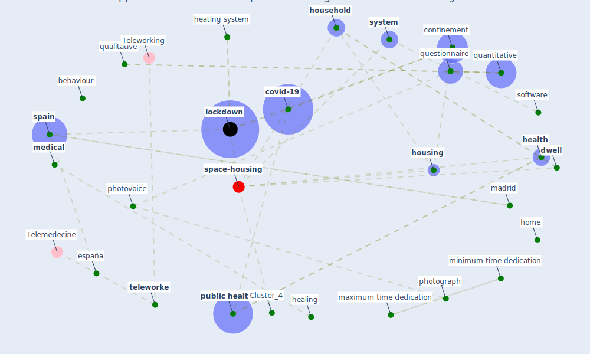

# Article: A Mixed Approach on Resilience of Spanish Dwellings and Households during COVID-19 Lockdown (cuerdo-vilches_mixed_2020)

* Source: [10.3390/su122310198](https://doi.org/10.3390/su122310198)
* Year: 2020
* Cluster: [housing-space](cluster_14)

## Keywords

 * [age group](keyword_age_group), appliance, appolloni, behaviour, bias, [build environment](keyword_build_environment), clapp, close, [comfort](keyword_comfort), [confinement](keyword_confinement), consumption, cool system, [coronavirus](keyword_coronavirus), [covid 19 pandemic](keyword_covid_19_pandemic), [covid-19](keyword_covid-19), d alessandro, datum analysis, dedication, [device](keyword_device), dichotomous, discourse, dishwasher, domestic space, dwell, déne, [education](keyword_education), [energy](keyword_energy), [energy consumption](keyword_energy_consumption), energy expenditure, equipment, españa, estadística, [europe](keyword_europe), [european union](keyword_european_union), fara, frequency, gola, gumel, habit, habitability, hamadani, healing, [health](keyword_health), heating system, [home](keyword_home), home space, hot water, [household](keyword_household), household appliance, [housing](keyword_housing), [image](keyword_image), [indoor air quality](keyword_indoor_air_quality), kraków, leisure, [lockdown](keyword_lockdown), m n m, m á, madrid, maximum time dedication, [medical](keyword_medical), minimum time dedication, nešovic, nivel y condiciones de vida, online form, open, [pandemic](keyword_pandemic), [participant](keyword_participant), participation, period, photo, photograph, photovoice, [poland](keyword_poland), possible, prtesti, [public health](keyword_public_health), [qualitative](keyword_qualitative), quantitative, quantitative questionnaire, questionnaire, [research](keyword_research), s j, software, song, [space](keyword_space), [spain](keyword_spain), spanish, sport, spring, stata, [survey](keyword_survey), surveymonkey, [system](keyword_system), t c v, t n m, teleworke, valid, view, virtue, washing machine

## Concepts

 

## Neighbours

### Closest articles

* Questioning the use of the balcony in apartments during the COVID-19 pandemic process - [LINK](article_aydin_questioning_2020)
* Housing Experience in Gated Communities in the Time of Pandemics: Lessons Learned from COVID-19 - [LINK](article_asfour_housing_2022)
* How Architecture Fails in Conditions of Crisis: a Discussion on the Value of Interior Design over the COVID-19 Outbreak - [LINK](article_rassia_how_2020)
* Urban Community Sustainable Development Patterns under the Influence of COVID-19: A Case Study Based on the Non-Contact Interaction Perspective of Hangzhou City - [LINK](article_wang_urban_2021)
* Biophilic design in architecture and its contributions to health, well-being, and sustainability: A critical review - [LINK](article_zhong_biophilic_2022)
* 10 Adaptive Measures for Public Places to face the COVID 19 Pandemic Outbreak - [LINK](article_cheshmehzangi_10_2020)
* How the Coronavirus Will Reshape Architecture - [LINK](article_chayka_how_2020)
* Impact of COVID-19 on IoT Adoption in Healthcare, Smart Homes, Smart Buildings, Smart Cities, Transportation and Industrial IoT - [LINK](article_umair_impact_2021)
* COVID-19 Lessons for a Resilient Built Environment: A Roadmap - [LINK](article_hull_covid-19_2020)

### Closest BPs

* Blueprint: Tracking and enforcing use of Personal Protective Equipment - [LINK](bp_23)
* Blueprint: Resilience in staffing and skills training - [LINK](bp_12)
* Blueprint: Architecture design - [LINK](bp_2)
