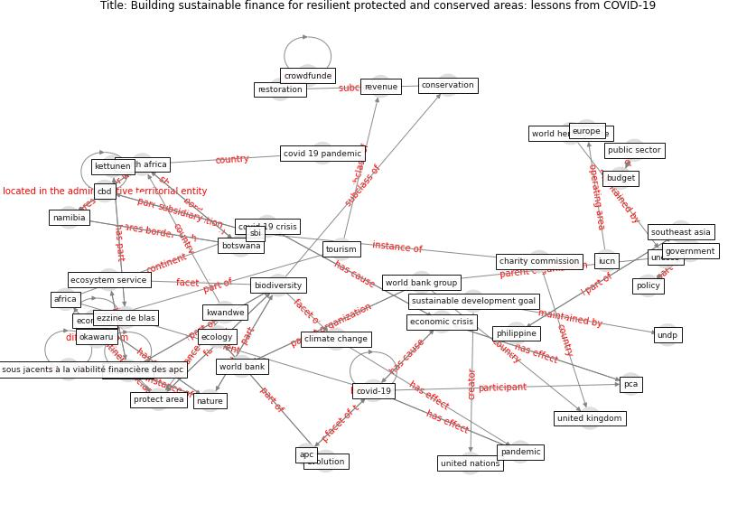

# Article: Building sustainable finance for resilient protected and conserved areas: lessons from COVID-19 (cumming_building_2021)

* Source: [10.2305/IUCN.CH.2021.PARKS-27-SITC.en](https://doi.org/10.2305/IUCN.CH.2021.PARKS-27-SITC.en)
* Year: 2021
* Cluster: [health-pca](cluster_9)

## Keywords

 * actividades, adaptation, [africa](keyword_africa), anthropocene, [apc](keyword_apc), barrett a, becker c, belize, berry p, [biodiversity](keyword_biodiversity), biodiversity finance initiative, biome, botswana, [brazil](keyword_brazil), budget, [business](keyword_business), cbd, charity commission, [climate change](keyword_climate_change), colorado state university, [conservation](keyword_conservation), conservation finance, conservation international, contraintes sous jacents à la viabilité financière des apc, [country](keyword_country), [covid 19 crisis](keyword_covid_19_crisis), [covid 19 pandemic](keyword_covid_19_pandemic), [covid-19](keyword_covid-19), crowdfunde, currentcffffcrisis, droste n, eastern, ecology, [economic](keyword_economic), economic crisis, [economy](keyword_economy), [ecosystem](keyword_ecosystem), ecosystem service, emerton l, [europe](keyword_europe), evolution, ezzine de blas, finance for nature, finance sector, g20, geneva, [global](keyword_global), [government](keyword_government), hol chan mp, iucn, [kenya](keyword_kenya), kettunen, kwandwe, laguna, livelihood, long term, mozambique, mulungu, [namibia](keyword_namibia), [nature](keyword_nature), [new york](keyword_new_york), ngo, okawaru, [pandemic](keyword_pandemic), [pca](keyword_pca), pca finance, pcas, philippine, pitas n, [policy](keyword_policy), protect area, public sector, reinvestment, reis p, restoration, revenue, [risk](keyword_risk), russi, sbi, seabra c, south, [south africa](keyword_south_africa), southeast asia, structural, [sustainable](keyword_sustainable), [sustainable development goal](keyword_sustainable_development_goal), [switzerland](keyword_switzerland), systemic, [tourism](keyword_tourism), undp, [unesco](keyword_unesco), [united kingdom](keyword_united_kingdom), [united nations](keyword_united_nations), walmart, [washington](keyword_washington), wildlife, [world bank](keyword_world_bank), world bank group, [world heritage site](keyword_world_heritage_site), wwf

## Concepts

 

## Neighbours

### Closest articles

* Covid-19 and asset management in EU: a preliminary assessment of performance and investment styles - [LINK](article_rizvi_covid-19_2020)
* Global value chains: Efficiency and risks in the context of COVID-19 - [LINK](article_oecd_global_2021)
* World Bank Development Report - [LINK](article_world_bank_world_2022)
* COVID-19 and regional solutions for mitigating the risk of SME finance in selected ASEAN member states - [LINK](article_taghizadeh-hesary_covid-19_2022)
* From Viral City to Smart City: Learning from Pandemic Experiences - [LINK](article_sakellarides_viral_2020)
* Mapping research in logistics and supply chain management during COVID-19 pandemic - [LINK](article_montoya-torres_mapping_2021)
* Amplifying the role of knowledge translation platforms in the COVID-19 pandemic response - [LINK](article_el-jardali_amplifying_2020)
* Startups in times of crisis – A rapid response to the COVID-19 pandemic - [LINK](article_kuckertz_startups_2020)
* <scp>COVID</scp>             ‐19: Small and medium enterprises challenges and responses with creativity, innovation, and entrepreneurship - [LINK](article_thukral_covid19_2021)
*  - [LINK](article_mehtab_alam_role_2021)

### Closest BPs

* Blueprint: Smart Locker System - [LINK](bp_1)
* Blueprint: Rotational Shift System - [LINK](bp_0)
* Blueprint: One-way mobility circulation - [LINK](bp_4)
