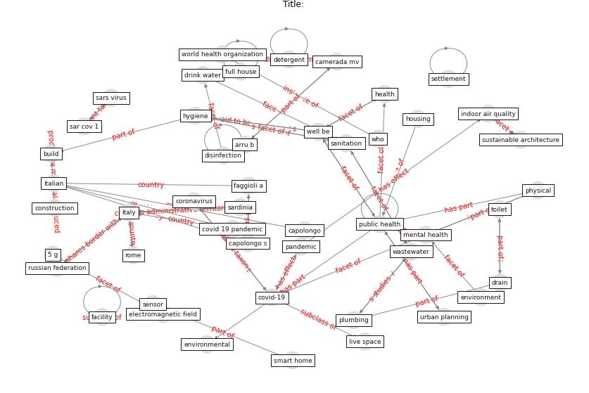

# Article: ____ (dalessandro_covid-19_2020)

* [10.23750/abm.v91i9-S.10115](https://doi.org/10.23750/abm.v91i9-S.10115)
* Cluster: [health-housing](cluster_8)

## Keywords

* [italy](keyword_italy), [public health](keyword_public_health), [covid-19](keyword_covid-19), [health](keyword_health), [mental health](keyword_mental_health), [capolongo s](keyword_capolongo_s), [covid 19 pandemic](keyword_covid_19_pandemic), [world health organization](keyword_world_health_organization), [wellbeing](keyword_wellbeing), [sanitation](keyword_sanitation), [hygiene](keyword_hygiene), [italian](keyword_italian), [who](keyword_who), [environment](keyword_environment), [housing](keyword_housing)

## Keywords at large

* [italy](keyword_italy), [public health](keyword_public_health), [covid-19](keyword_covid-19), [health](keyword_health), [mental health](keyword_mental_health), [capolongo s](keyword_capolongo_s), [covid 19 pandemic](keyword_covid_19_pandemic), [hygiene](keyword_hygiene), [wellbeing](keyword_wellbeing), [italian](keyword_italian)

## Abstract

Background and aim of the work: The ongoing pandemic of
COVID-19 is a strong reminder that the lockdown period has
changed the way that people and communities live, work, and
interact, and it’s necessary to make resilient the built
environment, both outdoor and mainly the indoor spaces:
housing, workplaces, public buildings, and entertainment
facilities. How can we re-design the concept of Well-being
and Public Health in relation to the living places of the
future? Methods: According to the previous statements and
scenario, this paper aims to integrate the building hygiene
and well-being, focusing the possible responses, both
existing and for the new buildings, taking home a strong
message from this “period” of physical distancing.
Results: The Well-being and Public Health recommendations
for a healthy, safe, and sustainable housing are framed
into the following key points: 1. Visible and accessible
green elements and spaces; 2. Flexibility, adaptability,
sharing, and crowding of living spaces, and compliant
functions located into the buildings; 3. Re-appropriation
of the basic principles and archetypes of sustainable
architecture, thermal comfort and Indoor Air Quality (IAQ);
4. Water consumption and Wastewater Management; 5. Urban
Solid Waste Management; 6. Housing automation and
electromagnetic fields; 7. Indoor building and finishing
materials. Conclusions: The Well-being and Public Health
recommendations for a healthy, safe and sustainable housing
may provide a useful basis for Designers, Policy Makers
(fostering tax incentives for building renewal), Public
Health experts and Local Health Agencies, in promoting
actions and policies aimed to transform living places in
healthier and Salutogenic spaces.

## Concepts

 

### Closest articles 

* [Prophylactic Architecture: Formulating the Concept of Pandemic-Resilient Homes](article_elrayies_prophylactic_2022)
* [How is COVID-19 Experience Transforming Sustainability Requirements of Residential Buildings? A Review](article_tokazhanov_how_2020)
* [COVID-19 and Green Housing: A Review of Relevant Literature](article_kaklauskas_covid-19_2021)
* [Towards Resilient Residential Buildings and Neighborhoods in Light of COVID-19 Pandemic—The Scenario of Podgorica, Montenegro](article_bojovic_towards_2022)
* [realdania_refleksioner_2022_EN](article_realdania_refleksioner_2022_EN)
* [How our homes impact our health: using a COVID-19 informed approach to examine urban apartment housing](article_peters_how_2020)
* [How the Coronavirus Will Reshape Architecture](article_chayka_how_2020)
* [RESIDENTIAL ARCHITECTURE IN A POST-PANDEMIC WORLD: IMPLICATIONS OF COVID-19 FOR NEW CONSTRUCTION AND FOR ADAPTING HERITAGE BUILDINGS](article_spennemann_residential_2021)
* [Adaptive Design of the Built Environment to Mitigate the Transmission Risk of COVID-19](article_ara_dilshad_shangi_adaptive_2020)
* [Questioning the use of the balcony in apartments during the COVID-19 pandemic process](article_aydin_questioning_2020)

