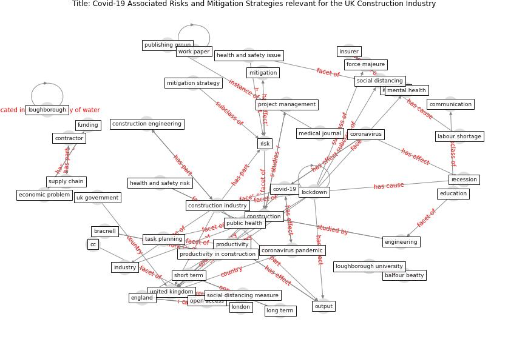

# Article: __Covid-19 Associated Risks and Mitigation Strategies relevant for the UK Construction Industry__ (dan-jumbo_covid-19_2021)

* [10.20935/AL1485](https://doi.org/10.20935/AL1485)
* Cluster: [construction-project](cluster_3)

## Keywords

* [united kingdom](keyword_united_kingdom), [covid-19](keyword_covid-19), [open access](keyword_open_access), [construction](keyword_construction), [cc](keyword_cc), [construction industry](keyword_construction_industry), [lockdown](keyword_lockdown), [risk](keyword_risk), [coronavirus](keyword_coronavirus), [mitigation strategy](keyword_mitigation_strategy), recession, england, [contractor](keyword_contractor), loughborough, [productivity](keyword_productivity)

## Keywords at large

* [biophilic design](keyword_biophilic_design), [architecture](keyword_architecture), [sustainable architecture](keyword_sustainable_architecture), [nature](keyword_nature), [design](keyword_design), [biophilic](keyword_biophilic), [environ](keyword_environ), [biophilia](keyword_biophilia), [wellbeing](keyword_wellbeing), [health](keyword_health)

## Concepts

 

