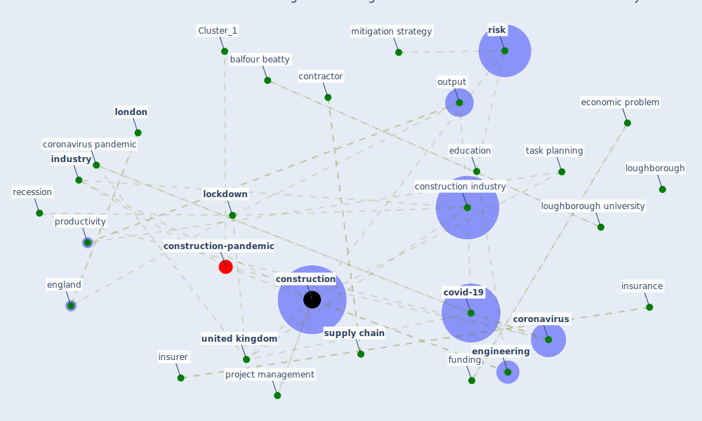

# Article: Covid-19 Associated Risks and Mitigation Strategies relevant for the UK Construction Industry (dan-jumbo_covid-19_2021)

* Source: [10.20935/AL1485](https://doi.org/10.20935/AL1485)
* Year: 2021
* Cluster: [construction-pandemic](cluster_1)

## Keywords

 * [anxiety](keyword_anxiety), balfour beatty, bracnell, breach of contract, burrell, clinical, communication, [construction](keyword_construction), construction engineering, [construction industry](keyword_construction_industry), [contract](keyword_contract), [contractor](keyword_contractor), [coronavirus](keyword_coronavirus), coronavirus crisis, coronavirus crisis in the uk, coronavirus induce recession, coronavirus pandemic, covid 19 outbreak, [covid 19 pandemic](keyword_covid_19_pandemic), [covid-19](keyword_covid-19), delay project, dispute resolution, download file, economic indicator, economic measure, economic problem, economic recession, [education](keyword_education), [efficiency](keyword_efficiency), [employer](keyword_employer), [engineering](keyword_engineering), england, [epidemiological](keyword_epidemiological), fawzy, financial, force majeure, funding, furlough scheme, gang tasking, gdp, [health](keyword_health), [health and safety](keyword_health_and_safety), health and safety executive, health and safety risk, heriot watt university, house of commons library, [industry](keyword_industry), [infectious disease](keyword_infectious_disease), insurance, insurer, intervention, labour shortage, [lockdown](keyword_lockdown), [london](keyword_london), long term, loughborough, loughborough university, low productivity, [mitigation](keyword_mitigation), mitigation strategy, [model](keyword_model), nimi dan jumbo, nimid, notice, oman, operative, output, pandemic crisis, practice, procedure, [productivity](keyword_productivity), productivity in construction, [project management](keyword_project_management), [public health](keyword_public_health), public health response to covid 19, publication stat, [quality](keyword_quality), recession, reduce manpower, reduce productivity, repudiation, request enhancement, [risk](keyword_risk), second shift, short term, [smart](keyword_smart), statutory adjudication, [supply chain](keyword_supply_chain), sustainable, task planning, termination, [training](keyword_training), transmissivity, uk government, uk lockdown, [unesco](keyword_unesco), [united kingdom](keyword_united_kingdom), unprecedented economic recession, work paper, work procedure

## Concepts

 

## Neighbours

### Closest articles

* The Impact of Pandemic Crisis on the Survival of Construction Industry: A Case of COVID-19 - [LINK](article_gamil_impact_2020)
* Strategies to Mitigate COVID-19 Pandemic Impacts on Health and Safety of Workers in Construction Projects - [LINK](article_kaushal_strategies_2021)
* Mechanisms for addressing the impact of COVID-19 on infrastructure projects - [LINK](article_king_mechanisms_2021)
* Identifying Actions to Control and Mitigate the Effects of the COVID-19 Pandemic on Construction Organizations: Preliminary Findings - [LINK](article_raoufi_identifying_2021)
* Perception of COVID-19 impacts on the construction industry over time - [LINK](article_rokooei_perception_2022)
* Influence between COVID-19 Impacts and Project Stakeholders in Chilean Construction Projects - [LINK](article_araya_influence_2021)
* The Effects of Pandemic on Construction Industry in the UK - [LINK](article_shibani_effects_2020)
* Analysis of COVID-19 Concerns Raised by the Construction Workforce and Development of Mitigation Practices - [LINK](article_bou_hatoum_analysis_2021)
* COVID-19 pandemic: the effects and prospects in the construction industry. - [LINK](article_ogunnusi_covid-19_2020)
* Impacts of COVID-19 on Health and Safety of Workforce in Construction Industry - [LINK](article_pamidimukkala_impacts_2021)

### Closest BPs

* Blueprint: Monitoring of wastewater - [LINK](bp_21)
* Blueprint: Smart Locker System - [LINK](bp_1)
* Blueprint: Mental health – Belong: Do something with someone - [LINK](bp_19)
