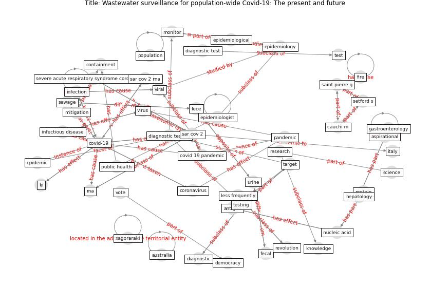

# Article: __Wastewater surveillance for population-wide Covid-19: The present and future__ (daughton_wastewater_2020)

* [10.1016/j.scitotenv.2020.139631](https://doi.org/10.1016/j.scitotenv.2020.139631)
* Cluster: [water-wastewater](cluster_15)

## Keywords

* [covid-19](keyword_covid-19), [sar cov 2](keyword_sar_cov_2), [infection](keyword_infection), [testing](keyword_testing), [pandemic](keyword_pandemic), [population](keyword_population), [infectious disease](keyword_infectious_disease), [diagnostic testing](keyword_diagnostic_testing), [covid 19 pandemic](keyword_covid_19_pandemic), [sewage](keyword_sewage), lp, [epidemiology](keyword_epidemiology), antigen, fece, nucleic acid

## Keywords at large

* [biophilic design](keyword_biophilic_design), [architecture](keyword_architecture), [sustainable architecture](keyword_sustainable_architecture), [nature](keyword_nature), [design](keyword_design), [biophilic](keyword_biophilic), [environ](keyword_environ), [biophilia](keyword_biophilia), [wellbeing](keyword_wellbeing), [health](keyword_health)

## Concepts

 

### References 

* [First confirmed detection of SARS-CoV-2 in untreated
wastewater in Australia: A proof of concept for the
wastewater surveillance of COVID-19 in the community](article_ahmed_first_2020)
* [Computational analysis of SARS-CoV-2/COVID-19
surveillance by wastewater-based epidemiology locally and
globally: Feasibility, economy, opportunities and
challenges](article_hart_computational_2020)
* [Future perspectives of wastewater-based epidemiology:
Monitoring infectious disease spread and resistance to
the community level](article_sims_future_2020)

### Cited by 

* [Wastewater-Based Epidemiology to monitor COVID-19
outbreak: Present and future diagnostic methods to be in
your radar](article_barcelo_wastewater-based_2020)
