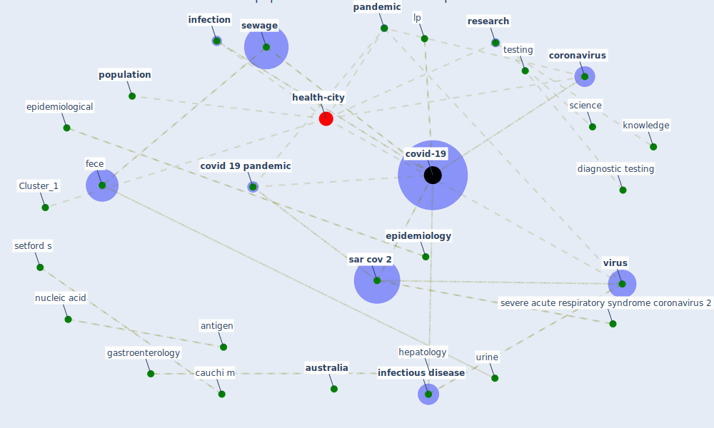

# Article: Wastewater surveillance for population-wide Covid-19: The present and future (daughton_wastewater_2020)

* Source: [10.1016/j.scitotenv.2020.139631](https://doi.org/10.1016/j.scitotenv.2020.139631)
* Year: 2020
* Cluster: [health-city](cluster_1)

## Keywords

 * anonymous, antibody, antigen, [anxiety](keyword_anxiety), aspirational, [australia](keyword_australia), [biomarker](keyword_biomarker), cauchi m, [china](keyword_china), [community](keyword_community), containment, [control](keyword_control), [coronavirus](keyword_coronavirus), countermeasure, [covid 19 pandemic](keyword_covid_19_pandemic), [covid-19](keyword_covid-19), [datum](keyword_datum), democracy, diagnostic, diagnostic test, diagnostic testing, domino effect, [economy](keyword_economy), [engineering](keyword_engineering), [epidemic](keyword_epidemic), [epidemiological](keyword_epidemiological), epidemiologist, [epidemiology](keyword_epidemiology), fecal, fece, [fire](keyword_fire), gastroenterology, generalization, [health](keyword_health), [hepatology](keyword_hepatology), [infection](keyword_infection), [infectious](keyword_infectious), infectious agent, [infectious disease](keyword_infectious_disease), [italy](keyword_italy), [knowledge](keyword_knowledge), less frequently, ljubljana, lp, manor y, [manufacture](keyword_manufacture), mass surveillance, microbiology, [mitigation](keyword_mitigation), [monitor](keyword_monitor), morbiditie, national, nevada, news medium, ng s, nucleic acid, [outbreak](keyword_outbreak), [pandemic](keyword_pandemic), [panic](keyword_panic), [pathogen](keyword_pathogen), per capita, persistence, pharyngeal, pool sample, [population](keyword_population), pre proof, proof who, prophylaxi, protein, [public health](keyword_public_health), ren l, [research](keyword_research), revolution, [rna](keyword_rna), saint pierre g, [sar cov 2](keyword_sar_cov_2), sar cov 2 rna, science, setford s, severe acute respiratory syndrome coronavirus 2, [sewage](keyword_sewage), sim, [society](keyword_society), stool, [supply chain](keyword_supply_chain), supply chain shortage, surface water, [surveillance](keyword_surveillance), target, [test](keyword_test), testing, urine, [viral](keyword_viral), [virus](keyword_virus), vote, [wastewater](keyword_wastewater), waterra, [wuhan](keyword_wuhan), xagoraraki, zhang x

## Concepts

 

## Neighbours

### Closest articles

* SARS-CoV-2 in wastewater: potential health risk, but also data source - [LINK](article_lodder_sars-cov-2_2020)
* Supporting Technologies for COVID-19 Prevention: Systemized Review - [LINK](article_zhao_supporting_2022)
* 10 tech trends getting us through the COVID-19 pandemic - [LINK](article_yan_10_2020)
* Emergency Healthcare Facilities: Managing Design in a Post Covid-19 World - [LINK](article_marinelli_emergency_2020)
* Contributions to the mitigation of the COVID-19 pandemic - [LINK](article_pilz_contributions_2022)
* COVID-19 Prevention and Control Measures in Workplace Settings: A Rapid Review and Meta-Analysis - [LINK](article_ingram_covid-19_2021)
* Physical interventions to interrupt or reduce the spread of respiratory viruses: systematic review - [LINK](article_jefferson_physical_2008)
* COVID-19: A new digital dawn? - [LINK](article_robbins_covid-19_2020)
* Pandemic Analytics: How Countries are Leveraging Big Data Analytics and Artificial Intelligence to Fight COVID-19? - [LINK](article_mehta_pandemic_2021)
* Management of the COVID-19 pandemic: challenges, practices, and organizational support - [LINK](article_hossny_management_2022)

### Closest BPs

* Blueprint: Resilience in staffing and skills training - [LINK](bp_12)
* Blueprint: Negative pressure rooms - [LINK](bp_13)
* Blueprint: Smart Locker System - [LINK](bp_1)
