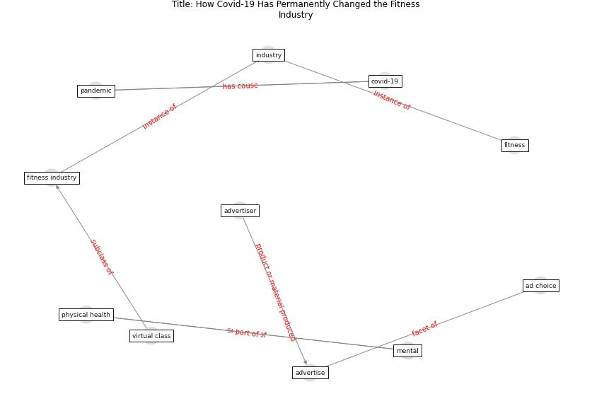

# Article: How Covid-19 Has Permanently Changed the FitnessIndustry (davalos_how_2021)

* [https://www.bloomberg.com/news/articles/2021-01-19/fitness-industry-may-never-return-to-its-old-ways-after-covid-19](https://www.bloomberg.com/news/articles/2021-01-19/fitness-industry-may-never-return-to-its-old-ways-after-covid-19)
* Year: 2021
* Cluster: [mental-health](cluster_11)

## Keywords

 * ad choice, [advertise](keyword_advertise), advertiser, [covid-19](keyword_covid-19), [fitness](keyword_fitness), fitness industry, [industry](keyword_industry), [mental](keyword_mental), [pandemic](keyword_pandemic), [physical health](keyword_physical_health), virtual class

## Concepts

 

## Neighbours

### Closest articles

* Assessing the health and hygiene performance of apartment buildings - [LINK](article_ho_assessing_2004)
* Rotating groups at work, school best against COVID-19 spread: Study - [LINK](article_afp_rotating_2021)
* Reframe how to serve your community in the midst of a pandemic - [LINK](article_sutton_reframe_2020)
* A Platform for Citizen Cooperation during the COVID-19 Pandemic in RN, Brazil - [LINK](article_de_araujo_platform_2020)
* Assessment of COVID-19 precautionary measures in sports facilities: A case study on a health club in Saudi Arabia - [LINK](article_ibrahim_assessment_2022)
* Construction of a Linked Data Set of COVID-19 Knowledge Graphs: Development and Applications - [LINK](article_wang_construction_2022)
* COVID-19 and social inequalities: a complex and dynamic interaction - [LINK](article_quantin_covid-19_2022)
* How loneliness is talked about in social media during COVID-19 pandemic: Text mining of 4,492 Twitter feeds - [LINK](article_koh_how_2022)
* Sustainable work throughout the life course: National policies and strategies, Publications Office of the European Union - [LINK](article_eurofund_sustainable_2016)

### Closest BPs

* Resilience in staffing and skills training - [LINK](bp_12)
* Air Cleaning Plants - [LINK](bp_15)
* Public places as information points - [LINK](bp_8)
