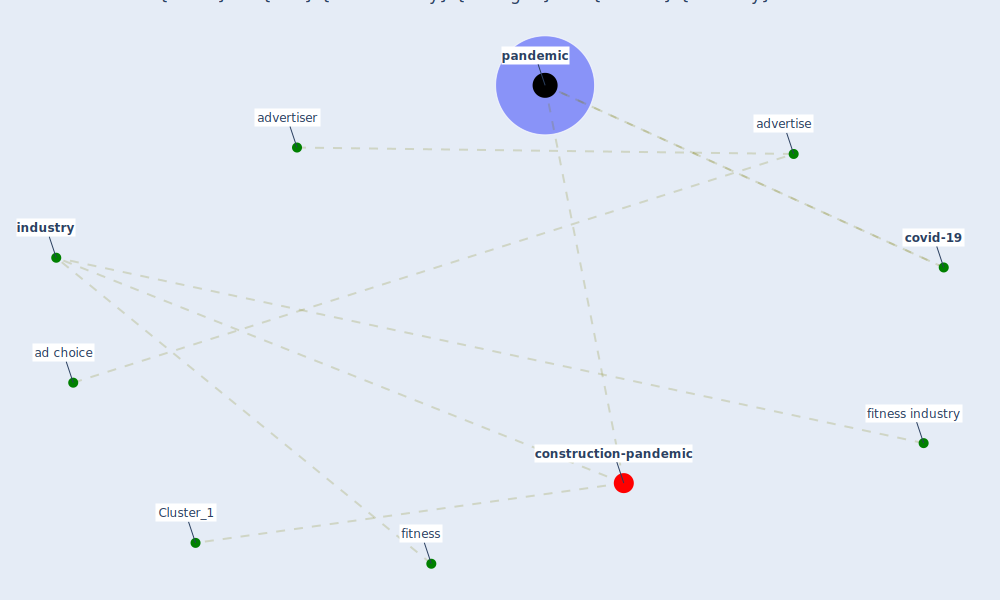

# Article: How Covid-19 Has Permanently Changed the Fitness Industry (davalos_how_2021)

* [https://www.bloomberg.com/news/articles/2021-01-19/fitness-industry-may-never-return-to-its-old-ways-after-covid-19](https://www.bloomberg.com/news/articles/2021-01-19/fitness-industry-may-never-return-to-its-old-ways-after-covid-19)
* Year: 2021
* Cluster: [health-city](cluster_1)

## Keywords

 * [ad choice](keyword_ad_choice), [advertise](keyword_advertise), advertiser, [covid-19](keyword_covid-19), fitness, fitness industry, [industry](keyword_industry), [pandemic](keyword_pandemic)

## Concepts

 

## Neighbours

### Closest articles

* A Platform for Citizen Cooperation during the COVID-19 Pandemic in RN, Brazil - [LINK](article_de_araujo_platform_2020)
* Assessing the health and hygiene performance of apartment buildings - [LINK](article_ho_assessing_2004)
* How loneliness is talked about in social media during COVID-19 pandemic: Text mining of 4,492 Twitter feeds - [LINK](article_koh_how_2022)
* What has been the impact of the COVID-19 pandemic on immigrants? An update on recent evidence - [LINK](article_oecd_what_2022)
* Rotating groups at work, school best against COVID-19 spread: Study - [LINK](article_afp_rotating_2021)
* Reframe how to serve your community in the midst of a pandemic - [LINK](article_sutton_reframe_2020)
* COVID-19 Bulletin 1: Alterations to BREEAM assessment requirements as a result of the Coronavirus pandemic – Knowledge Base - [LINK](article_breeam_covid-19_2020)

### Closest BPs

* Blueprint: Resilience in staffing and skills training - [LINK](bp_12)
* Blueprint: Installing high-efficiency air filters - [LINK](bp_11)
* Blueprint: Smart Locker System - [LINK](bp_1)
