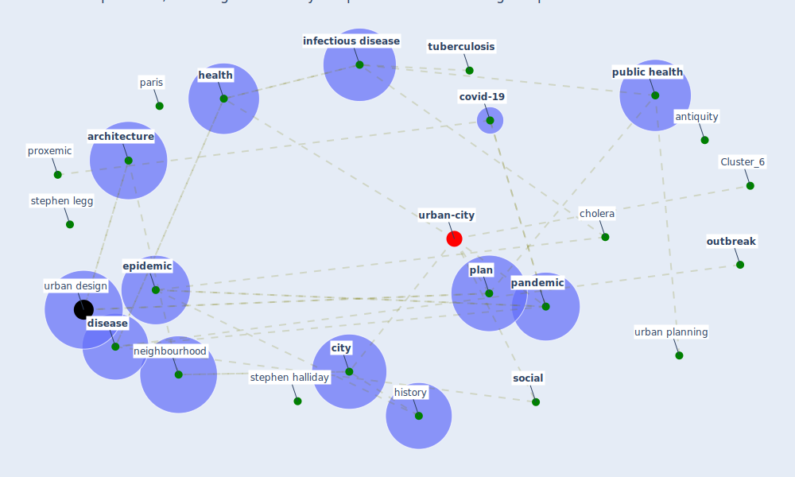

# Article: Epidemics, Planning and the City: A Special Issue of Planning Perspectives (davis_epidemics_2022)

* Source: [10.1080/02665433.2022.2019982](https://doi.org/10.1080/02665433.2022.2019982)
* Year: 2022
* Cluster: [health-city](cluster_1)

## Keywords

 * 11 halliday, ahrc, anglo indian, antibodie, antiquity, [architecture](keyword_architecture), asia, [australia](keyword_australia), affect the lung, benjamin, benjamin ward, black death, british africa, [cholera](keyword_cholera), cholera bacterium, choza, christian, [city](keyword_city), city make, [covid-19](keyword_covid-19), development, discipline and punish, [disease](keyword_disease), disease transmission, drainage infrastructure, east london, emergence and spread of disease, [environmental](keyword_environmental), [epidemic](keyword_epidemic), [europe](keyword_europe), european, gustavo machado, [health](keyword_health), hippocrate, history, history of pandemic, [human health](keyword_human_health), [india](keyword_india), [infectious disease](keyword_infectious_disease), john gold, joseph bazalgette, kenneth, kolkata, [london](keyword_london), london school of economic, madrid, maria cristina, mehta, miasma, microbiological, neighbourhood, new haven, new zealand, origin, [outbreak](keyword_outbreak), [pandemic](keyword_pandemic), paris, plague, plague of athens, [plan](keyword_plan), planning control, pollard, [present](keyword_present), prison, professor, proxemic, public domain, [public health](keyword_public_health), public park movement, sana a, sanitary movement, scourge, second, slum clearance, [social](keyword_social), socio economic, socioeconomic, stephen halliday, stephen legg, teach, tennis court, [toronto](keyword_toronto), transformation, [transmission](keyword_transmission), [tuberculosis](keyword_tuberculosis), urban design, urban fabric, urban governance arrangement, urban grid, urban life, [urban planning](keyword_urban_planning), urban society, [vaccine](keyword_vaccine), venice, war tear yemen, water borne disease, wellcome collection, yale university press, yersinisa pestis bacillus, flea

## Concepts

 

## Neighbours

### Closest articles

* COVID-19: Lessons for an Urban(izing) World - [LINK](article_acuto_covid-19_2020)
* Respiratory pandemics, urban planning and design: A multidisciplinary rapid review of the literature - [LINK](article_harris_respiratory_2022)
* Coronavirus questions that will not go away: interrogating urban and socio-spatial implications of COVID-19 measures - [LINK](article_salama_coronavirus_2020)
* The COVID-19 pandemic: Impacts on cities and major lessons for urban planning, design, and management - [LINK](article_sharifi_covid-19_2020)
* COVID-19 Pandemic: Rethinking Strategies for Resilient Urban Design, Perceptions, and Planning - [LINK](article_afrin_covid-19_2021)
* Pandemic stricken cities on lockdown. Where are our planning and design professionals [now, then and into the future]? - [LINK](article_allam_pandemic_2020)
* The Role of Architecture and Urbanism in Preventing Pandemics - [LINK](article_kumar_role_2021)
* On the Coronavirus (COVID-19) Outbreak and the Smart City Network: Universal Data Sharing Standards Coupled with Artificial Intelligence (AI) to Benefit Urban Health Monitoring and Management - [LINK](article_allam_coronavirus_2020)
* Proximity and post-COVID-19 urban development: Reflections from Milan, Italy - [LINK](article_tricarico_proximity_2021)

### Closest BPs

* Blueprint: Monitoring of wastewater - [LINK](bp_21)
* Blueprint: Resilience in staffing and skills training - [LINK](bp_12)
* Blueprint: Air Cleaning Plants - [LINK](bp_15)
