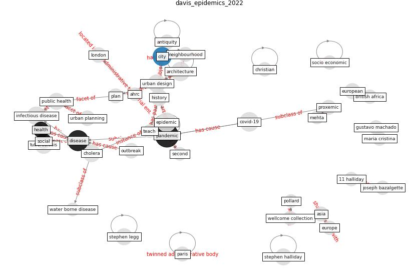

# Article: __Epidemics, Planning and the City: A Special Issue of Planning Perspectives__ (davis_epidemics_2022)

* [10.1080/02665433.2022.2019982](https://doi.org/10.1080/02665433.2022.2019982)
* Cluster: [city-smart](cluster_10)

## Keywords

* [pandemic](keyword_pandemic), [disease](keyword_disease), [epidemic](keyword_epidemic), [covid-19](keyword_covid-19), [city](keyword_city), [infectious disease](keyword_infectious_disease), [architecture](keyword_architecture), [tuberculosis](keyword_tuberculosis), [urban design](keyword_urban_design), [cholera](keyword_cholera), [public health](keyword_public_health), history, [health](keyword_health), [european](keyword_european), [outbreak](keyword_outbreak)

## Keywords at large

* [pandemic](keyword_pandemic), [disease](keyword_disease), [epidemic](keyword_epidemic), [covid-19](keyword_covid-19), [architecture](keyword_architecture), [city](keyword_city), [infectious disease](keyword_infectious_disease), [urban design](keyword_urban_design), [tuberculosis](keyword_tuberculosis), [cholera](keyword_cholera)

## Concepts

 

### Closest articles 

* [Coronavirus questions that will not go away: interrogating urban and socio-spatial implications of COVID-19 measures](article_salama_coronavirus_2020)
* [COVID-19: Lessons for an Urban(izing) World](article_acuto_covid-19_2020)
* [Respiratory pandemics, urban planning and design: A multidisciplinary rapid review of the literature](article_harris_respiratory_2022)
* [COVID-19 Pandemic: Rethinking Strategies for
Resilient Urban Design, Perceptions, and
Planning](article_afrin_covid-19_2021)
* [The COVID-19 pandemic: Impacts on cities and major lessons for urban planning, design, and management](article_sharifi_covid-19_2020)
* [WHO-2019-nCoV-Urban_preparedness-2020.1-eng](article_WHO-2019-nCoV-Urban_preparedness-2020.1-eng)
* [Antivirus-built environment: Lessons learned from Covid-19 pandemic](article_megahed_antivirus-built_2020)
* [The Impact of COVID-19 on Public Space: A Review of the Emerging Questions](article_honey-roses_impact_2020)
* [Pandemic stricken cities on lockdown. Where are our planning and design professionals [now, then and into the future]?](article_allam_pandemic_2020)
* [Learning from pandemics: Applying resilience thinking to identify priorities for planning urban settlements](article_syal_learning_2021)

