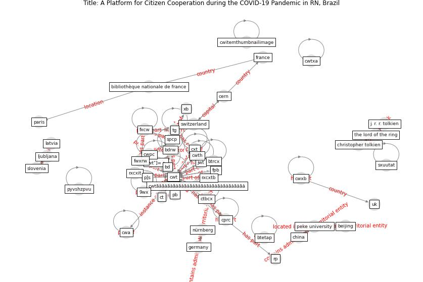

# Article: A Platform for Citizen Cooperation during the COVID-19 Pandemic in RN, Brazil (de_araujo_platform_2020)

* Source: [10.1109/ISC251055.2020.9239008](https://doi.org/10.1109/ISC251055.2020.9239008)
* Year: 2020
* Cluster: [health-patient](cluster_14)

## Keywords

 * 9el, 9wx, anthropocene, at, bcpac d _, bk, cda, cern, [cwt](keyword_cwt), dacwta, dbtab, fdq, fpb, ft, fwxrw, ilspl, [india](keyword_india), [italy](keyword_italy), itrcx, iwpax, [jse](keyword_jse), [jwt](keyword_jwt), mmt, mt, n o, p s, pac, papp, [pb](keyword_pb), pbc, pbwq, pbzt, pc, pct, [pcu](keyword_pcu), pcx, peke university, pescatella, ppp, pppx, pq, prrt, pst, punist, pvpx, px, pzo, qh, qpbt, qt, qtt, qtx, qvtv, rp, rpcx, [russia](keyword_russia), rwp, sdax, spcp, sphb, spx, srp, st, st petersburg, stet, stonewall riot, [switzerland](keyword_switzerland), t _ t, tab, tb, [unesco](keyword_unesco), unexpectedly, [united kingdom](keyword_united_kingdom), utp, utpcdatb, ux, vatt, vt, vts, [world heritage site](keyword_world_heritage_site), wpet, wps, wt, [wtp](keyword_wtp), wxvw, xb, xc, xe, xr, xrpcx, xst, xtensible, xx, xxx, yzhz, zohz, ztt, αɔ, ییی, सर र

## Concepts

 

## Neighbours

### Closest articles

* Assessing the health and hygiene performance of apartment buildings - [LINK](article_ho_assessing_2004)
* Construction of a Linked Data Set of COVID-19 Knowledge Graphs: Development and Applications - [LINK](article_wang_construction_2022)
* How Covid-19 Has Permanently Changed the Fitness Industry - [LINK](article_davalos_how_2021)
* COVID-19 Bulletin 1: Alterations to BREEAM assessment requirements as a result of the Coronavirus pandemic – Knowledge Base - [LINK](article_breeam_covid-19_2020)
* Reframe how to serve your community in the midst of a pandemic - [LINK](article_sutton_reframe_2020)
* Rotating groups at work, school best against COVID-19 spread: Study - [LINK](article_afp_rotating_2021)
* Risk Diagnosis and Mitigation System of COVID-19 Using Expert System and Web Scraping - [LINK](article_mufid_risk_2020)
* The City Under COVID‐19: Podcasting As Digital Methodology - [LINK](article_rogers_city_2020)
* What has been the impact of the COVID-19 pandemic on immigrants? An update on recent evidence - [LINK](article_oecd_what_2022)

### Closest BPs

* Blueprint: Resilience in staffing and skills training - [LINK](bp_12)
* Blueprint: Smart Locker System - [LINK](bp_1)
* Blueprint: One-way mobility circulation - [LINK](bp_4)
