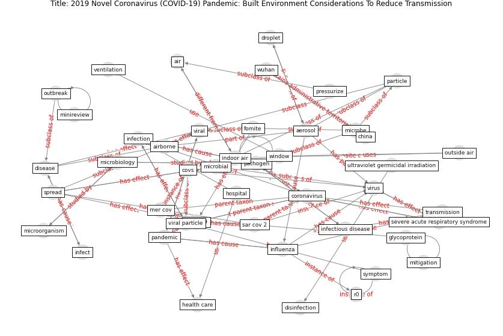

# Article: __2019 Novel Coronavirus (COVID-19) Pandemic: Built Environment Considerations To Reduce Transmission__ (dietz_2019_2020)

* [10.1128/mSystems.00245-20](https://doi.org/10.1128/mSystems.00245-20)
* Cluster: [air-ventilation](cluster_8)

## Keywords

[coronavirus](keyword_coronavirus), [virus](keyword_virus), [china](keyword_china), [transmission](keyword_transmission), [aerosol](keyword_aerosol), [pandemic](keyword_pandemic), [viral](keyword_viral), [ventilation](keyword_ventilation)

## Abstract

With the rapid spread of severe acute respiratory syndrome
coronavirus 2 (SARS-CoV-2) that results in coronavirus
disease 2019 (COVID-19), corporate entities, federal,
state, county, and city governments, universities, school
districts, places of worship, prisons, health care
facilities, assisted living organizations, daycares,
homeowners, and other building owners and occupants have an
opportunity to reduce the potential for transmission
through built environment (BE)-mediated pathways. Over the
last decade, substantial research into the presence,
abundance, diversity, function, and transmission of
microbes in the BE has taken place and revealed common
pathogen exchange pathways and mechanisms. , ABSTRACT With
the rapid spread of severe acute respiratory syndrome
coronavirus 2 (SARS-CoV-2) that results in coronavirus
disease 2019 (COVID-19), corporate entities, federal,
state, county, and city governments, universities, school
districts, places of worship, prisons, health care
facilities, assisted living organizations, daycares,
homeowners, and other building owners and occupants have an
opportunity to reduce the potential for transmission
through built environment (BE)-mediated pathways. Over the
last decade, substantial research into the presence,
abundance, diversity, function, and transmission of
microbes in the BE has taken place and revealed common
pathogen exchange pathways and mechanisms. In this paper,
we synthesize this microbiology of the BE research and the
known information about SARS-CoV-2 to provide actionable
and achievable guidance to BE decision makers, building
operators, and all indoor occupants attempting to minimize
infectious disease transmission through environmentally
mediated pathways. We believe this information is useful to
corporate and public administrators and individuals
responsible for building operations and environmental
services in their decision-making process about the degree
and duration of social-distancing measures during viral
epidemics and pandemics.

Author Video : An author video summary of this article is
available.

## Concepts

 

### References 

* [Persistence of coronaviruses on inanimate surfaces and
their inactivation with biocidal agents](article_kampf_persistence_2020)
* [Applications of ultraviolet germicidal irradiation
disinfection in health care facilities: Effective
adjunct, but not stand-alone technology](article_memarzadeh_applications_2010)
* [The Effect of Opening Windows on Air Change
Rates in Two Homes](article_howard-reed_effect_2002)
* [Architectural Design Drives the Biogeography of
Indoor Bacterial Communities](article_kembel_architectural_2014)

### Cited by 

* [Ten questions concerning occupant health in buildings
during normal operations and extreme events including the
COVID-19 pandemic](article_awada_ten_2021)* [The ventilation of buildings and other mitigating measures
for COVID-19: a focus on wintertime](article_burridge_ventilation_2021)* [Antivirus-built environment: Lessons learned from
Covid-19 pandemic](article_megahed_antivirus-built_2020)* [COVID-19 Experience Transforming the Protective
Environment of Office Buildings and Spaces](article_phapant_covid-19_2021)* [COVID-19 Could Leverage a Sustainable Built
Environment](article_pinheiro_covid-19_2020)* [RESIDENTIAL ARCHITECTURE IN A POST-PANDEMIC
WORLD: IMPLICATIONS OF COVID-19 FOR NEW
CONSTRUCTION AND FOR ADAPTING HERITAGE
BUILDINGS](article_spennemann_residential_2021)* [Impact of COVID-19 on IoT Adoption in Healthcare,
Smart Homes, Smart Buildings, Smart Cities,
Transportation and Industrial IoT](article_umair_impact_2021)
