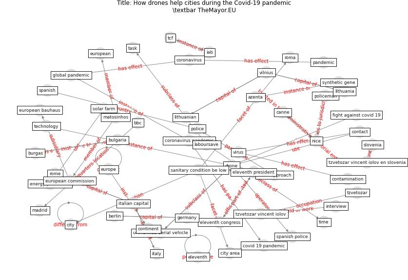

# Article: __How drones help cities during the Covid-19 pandemic \textbar TheMayor.EU__ (dimitrova_how_2021)

* URL: [https://www.themayor.eu/en/a/view/how-drones-help-cities-during-the-coronavirus-pandemic-4631](https://www.themayor.eu/en/a/view/how-drones-help-cities-during-the-coronavirus-pandemic-4631)
* Year: 2021
* Abstract: From Nice to Madrid and Burgas, EU cities mobilize
technology, including drones, against the coronavirus
pandemic.

## Keywords

* [drone](keyword_drone), [city](keyword_city), [vilnius](keyword_vilnius), [bulgaria](keyword_bulgaria), [europe](keyword_europe), [germany](keyword_germany), [burgas](keyword_burgas), [berlin](keyword_berlin), [italian capital](keyword_italian_capital), [european commission](keyword_european_commission), [lithuania](keyword_lithuania), [fight against covid 19](keyword_fight_against_covid_19), tcf, [coronavirus pandemic](keyword_coronavirus_pandemic), eleventh president

## Keywords at large

* [biophilic design](keyword_biophilic_design), [architecture](keyword_architecture), [sustainable architecture](keyword_sustainable_architecture), [nature](keyword_nature), [design](keyword_design), [biophilic](keyword_biophilic), [environ](keyword_environ), [biophilia](keyword_biophilia), [wellbeing](keyword_wellbeing), [health](keyword_health)

## Concepts

 

