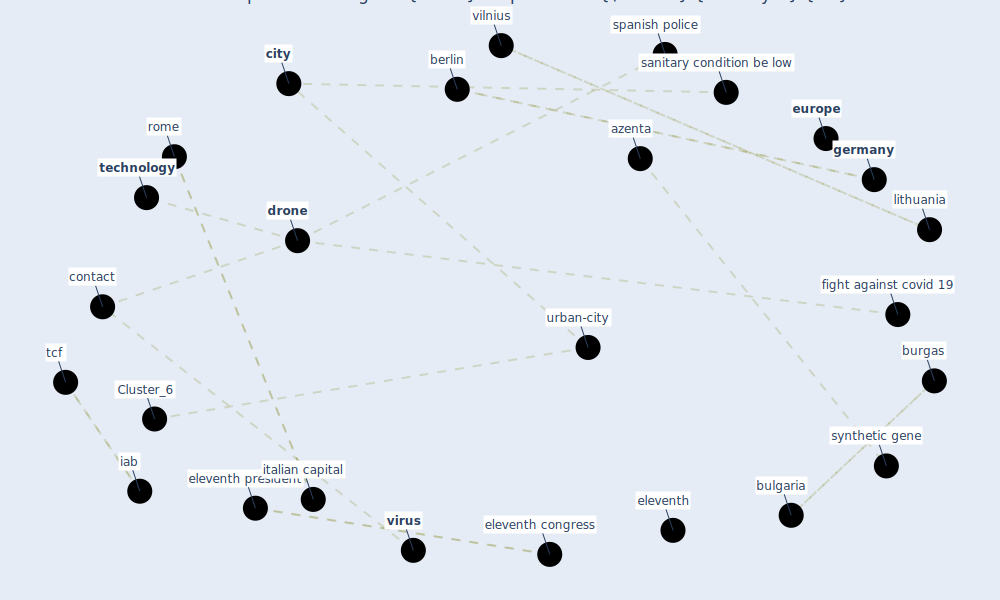

# Article: How drones help cities during the Covid-19 pandemic \textbar TheMayor.EU (dimitrova_how_2021)

* [https://www.themayor.eu/en/a/view/how-drones-help-cities-during-the-coronavirus-pandemic-4631](https://www.themayor.eu/en/a/view/how-drones-help-cities-during-the-coronavirus-pandemic-4631)
* Year: 2021
* Cluster: [health-city](cluster_1)

## Keywords

 * azenta, bbc, [berlin](keyword_berlin), [bulgaria](keyword_bulgaria), burgas, canne, [city](keyword_city), city area, [contact](keyword_contact), [contamination](keyword_contamination), continent, [coronavirus](keyword_coronavirus), coronavirus pandemic, [covid 19 pandemic](keyword_covid_19_pandemic), [drone](keyword_drone), eleventh, eleventh congress, eleventh president, [energy efficiency](keyword_energy_efficiency), energy production, [europe](keyword_europe), european, european bauhaus, european commission, european committee of the region, fight against covid 19, french, french riviera, [germany](keyword_germany), [human](keyword_human), iab, interview, italian capital, [italy](keyword_italy), laboursave, lithuania, lithuanian, madrid, matosinhos, new european bauhaus prize, nice, [pandemic](keyword_pandemic), police, police officer, policeman, riviera, roma, [rome](keyword_rome), same approach, sanitary condition be low, [slovenia](keyword_slovenia), solar farm, spanish, spanish police, synthetic gene, [task](keyword_task), tcf, [technology](keyword_technology), the same approach, [time](keyword_time), tzvetozar, tzvetozar vincent iolov, tzvetozar vincent iolov en slovenia, [vilnius](keyword_vilnius), [virus](keyword_virus)

## Concepts

 

## Neighbours

### Closest articles

* Drones. Disinfecting robots. Supercomputers. The coronavirus outbreak is a test for China's tech industry \textbar CNN Business - [LINK](article_wang_drones_2020)
* Danish disinfection robots save lives in the fight against the Corona virus \textbar Shaping Europe’s digital future - [LINK](article_ec_views_danish_2020)
* Combating COVID-19—The role of robotics in managing public health and infectious diseases - [LINK](article_yang_combating_2020)
* Mechanistic insights into the effect of humidity on airborne influenza virus survival, transmission and incidence - [LINK](article_marr_mechanistic_2019)
* Effects of temperature and humidity on the spread of COVID-19: A systematic review - [LINK](article_mecenas_effects_2020)
* Open-source analytics tools for studying the COVID-19 coronavirus outbreak - [LINK](article_wu_open-source_2020)
* Climate and the spread of COVID-19 - [LINK](article_chen_climate_2021)
* COVID-19 could be a seasonal illness with higher risk in winter: Reduced humidity linked to increased COVID-19 risk - [LINK](article_university_of_sydney_covid-19_2020)
* An investigation of transmission control measures during the first 50 days of the COVID-19 epidemic in China - [LINK](article_tian_investigation_2020)

### Closest BPs

* Blueprint: Installing UV in ductwork - [LINK](bp_10)
* Blueprint: Resilience in staffing and skills training - [LINK](bp_12)
* Blueprint: Negative pressure rooms - [LINK](bp_13)
