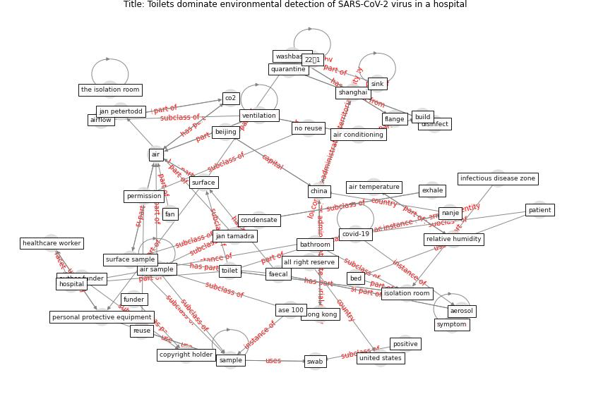

# Article: Toilets dominate environmental detection of SARS-CoV-2 virus in a hospital (ding_toilets_2020)

* Source: [10.1101/2020.04.03.20052175](https://doi.org/10.1101/2020.04.03.20052175)
* Year: 2020
* Cluster: [air-ventilation](cluster_13)

## Keywords

 * 22𒀦1, 679th floor, 7 holshue ml, abu dhabi, [aerosol](keyword_aerosol), [air](keyword_air), [air conditioning](keyword_air_conditioning), air sample, air temperature, airflow, all right reserve, analysis, [anteroom](keyword_anteroom), ase 100, [author funder](keyword_author_funder), bathroom, bathroom door, bed, [beijing](keyword_beijing), [build](keyword_build), cell culture medium, [china](keyword_china), co2, condensate, [copyright holder](keyword_copyright_holder), [corridor](keyword_corridor), [covid-19](keyword_covid-19), debolt c, [desk](keyword_desk), disinfect, doorway, exhale, exhaust, faecal, fan, fan coil, fifth floor ward, fill circle, flange, floorホ, [funder](keyword_funder), healthcare worker, [hong kong](keyword_hong_kong), [hospital](keyword_hospital), hospitalisation, hygiene, infectious disease zone, isolation room, [jan petertodd](keyword_jan_petertodd), [jan tamadra](keyword_jan_tamadra), jiangsu provincial center for disease control and prevention, keyboard, nanje, negative, negative air, no reuse, [nurse](keyword_nurse), nursing station, p value, [patient](keyword_patient), peke university, [permission](keyword_permission), [personal protective equipment](keyword_personal_protective_equipment), pneumonia, positive, positive surface, quarantine, relative humidity, reuse, rt pcr, [sample](keyword_sample), sampli, sar cov, [sar cov 2](keyword_sar_cov_2), serological, severe acute respiratory syndrome, [shanghai](keyword_shanghai), sink, spray button, statistically significant, [surface](keyword_surface), surface sample, surfacetouch, swab, [symptom](keyword_symptom), the isolation room, [toilet](keyword_toilet), uae, [united states](keyword_united_states), [university of hong kong](keyword_university_of_hong_kong), [usa](keyword_usa), usurper, [ventilation](keyword_ventilation), washbasin, who, [window](keyword_window), [wuhan](keyword_wuhan), yes no मममममममममम, z ding, zhang y

## Concepts

 

## Neighbours

### Closest articles

* Aerosol and Surface Distribution of Severe Acute Respiratory Syndrome Coronavirus 2 in Hospital Wards, Wuhan, China, 2020 - [LINK](article_guo_aerosol_2020)
* Air, Surface Environmental, and Personal Protective Equipment Contamination by Severe Acute Respiratory Syndrome Coronavirus 2 (SARS-CoV-2) From a Symptomatic Patient - [LINK](article_ong_air_2020)
* SARS-CoV-2 RNA detection of hospital isolation wards hygiene monitoring during the Coronavirus Disease 2019 outbreak in a Chinese hospital - [LINK](article_wang_sars-cov-2_2020)
* Rapid expansion of temporary, reliable airborne-infection isolation rooms with negative air machines for critical COVID-19 patients - [LINK](article_lee_rapid_2020)
* Real-world data show that filters clean COVID-causing virus from air - [LINK](article_thompson_real-world_2021)
* Exploring the Potential of Artificial Intelligence and Machine Learning to Combat COVID-19 and Existing Opportunities for LMIC: A Scoping Review - [LINK](article_naseem_exploring_2020)
* Pandemic Analytics: How Countries are Leveraging Big Data Analytics and Artificial Intelligence to Fight COVID-19? - [LINK](article_mehta_pandemic_2021)
* The removal of airborne SARS-CoV-2 and other microbial bioaerosols by air filtration on COVID-19 surge units - [LINK](article_conway-morris_removal_2021)
* COVID-19 and its Modes of Transmission - [LINK](article_karia_covid-19_2020)

### Closest BPs

* Blueprint: Installing high-efficiency air filters - [LINK](bp_11)
* Blueprint: Resilience in staffing and skills training - [LINK](bp_12)
* Blueprint: Antimicrobial Surfaces - [LINK](bp_5)
