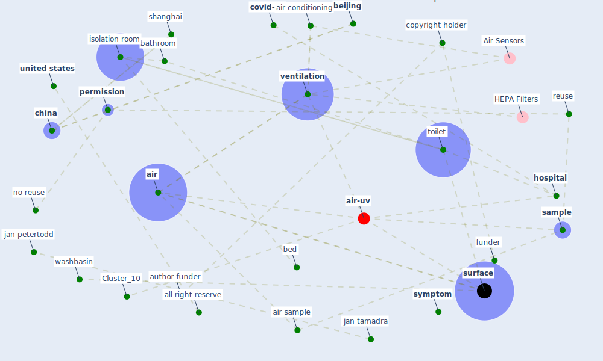

# Article: Toilets dominate environmental detection of SARS-CoV-2 virus in a hospital (ding_toilets_2020)

* Source: [10.1101/2020.04.03.20052175](https://doi.org/10.1101/2020.04.03.20052175)
* Year: 2020
* Cluster: [air-sars](cluster_9)

## Keywords

 * 22𒀦1, 679th floor, 7 holshue ml, abu dhabi, [aerosol](keyword_aerosol), [air](keyword_air), [air conditioning](keyword_air_conditioning), air sample, air temperature, airflow, all right reserve, [analysis](keyword_analysis), [anteroom](keyword_anteroom), ase 100, [author funder](keyword_author_funder), bathroom, bathroom door, bed, [beijing](keyword_beijing), cell culture medium, [china](keyword_china), co2, condensate, [copyright holder](keyword_copyright_holder), [covid-19](keyword_covid-19), disinfect, doorway, duplicate, emptycircle, [epidemiology](keyword_epidemiology), exhale, exhaust, faecal, fan, fan coil, fifth floor ward, fill circle, flange, floorホ, funder, healthcare worker, [hong kong](keyword_hong_kong), [hospital](keyword_hospital), hospitalisation, infectious disease zone, isolation room, [jan petertodd](keyword_jan_petertodd), [jan tamadra](keyword_jan_tamadra), keyboard, lvshaxin, [manipur](keyword_manipur), [medical](keyword_medical), molecular, nanje, negative, negative air, no reuse, nursing station, p value, [patient](keyword_patient), peke university, [permission](keyword_permission), [personal protective equipment](keyword_personal_protective_equipment), [perspective](keyword_perspective), pneumonia, positive, positive pressure, positive surface, quarantine, relative humidity, reuse, [sample](keyword_sample), sar cov, [sar cov 2](keyword_sar_cov_2), serological, severe acute respiratory syndrome, [shanghai](keyword_shanghai), sink, spray button, statistical, statistically significant, [surface](keyword_surface), surface sample, swab, [symptom](keyword_symptom), the isolation room, [toilet](keyword_toilet), uae, [united states](keyword_united_states), [university of hong kong](keyword_university_of_hong_kong), [usa](keyword_usa), usurper, [ventilation](keyword_ventilation), washbasin, who, [window](keyword_window), [wuhan](keyword_wuhan), yes no मममममममममम, z ding, zhang y

## Concepts

 

## Neighbours

### Closest articles

* Aerosol and Surface Distribution of Severe Acute Respiratory Syndrome Coronavirus 2 in Hospital Wards, Wuhan, China, 2020 - [LINK](article_guo_aerosol_2020)
* Air, Surface Environmental, and Personal Protective Equipment Contamination by Severe Acute Respiratory Syndrome Coronavirus 2 (SARS-CoV-2) From a Symptomatic Patient - [LINK](article_ong_air_2020)
* SARS-CoV-2 RNA detection of hospital isolation wards hygiene monitoring during the Coronavirus Disease 2019 outbreak in a Chinese hospital - [LINK](article_wang_sars-cov-2_2020)
* Rapid expansion of temporary, reliable airborne-infection isolation rooms with negative air machines for critical COVID-19 patients - [LINK](article_lee_rapid_2020)
* COVID-19 Forced Hospitals to Build Negative Pressure Rooms Fast - [LINK](article_dyer_covid-19_2020)
* COVID-19 and its Modes of Transmission - [LINK](article_karia_covid-19_2020)
* COVID-19 Pandemic: Prevention and Protection Measures to Be Adopted at the Workplace - [LINK](article_cirrincione_covid-19_2020)
* COVID-19: Risk assessment and mitigation measures in healthcare and non-healthcare workplaces - [LINK](article_fawzy_covid-19_2021)
* Current knowledge of COVID-19: Advances, challenges and future perspectives - [LINK](article_wu_current_2021)
* Real-world data show that filters clean COVID-causing virus from air - [LINK](article_thompson_real-world_2021)

### Closest BPs

* Blueprint: Negative pressure rooms - [LINK](bp_13)
* Blueprint: Installing high-efficiency air filters - [LINK](bp_11)
* Blueprint: Installing UV in ductwork - [LINK](bp_10)
