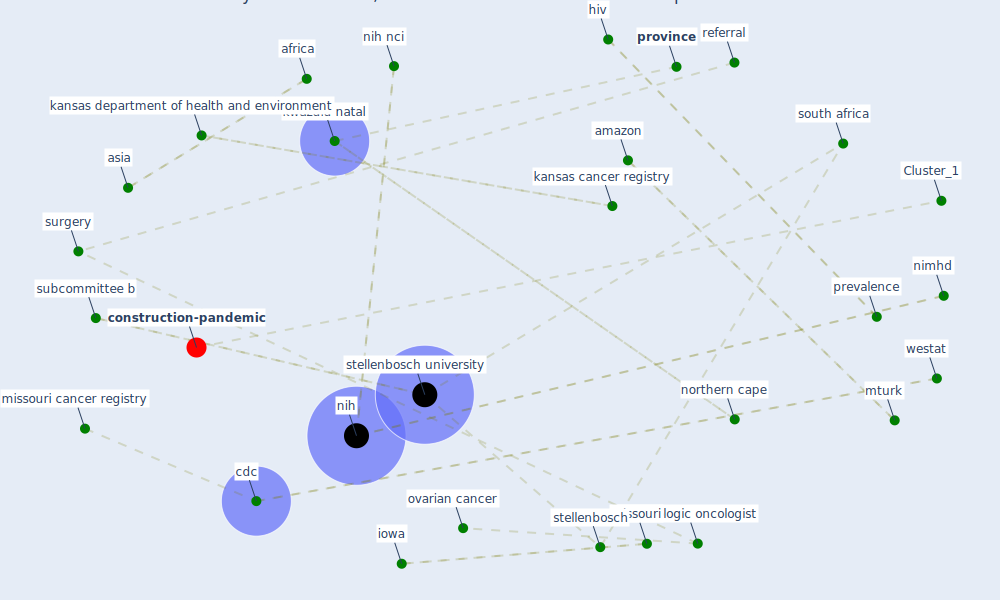

# Article: Multilevel Analysis of Personal, Non-Medical COVID-19-Related Impact Worldwide (dye_multilevel_2020)

* Source: [10.1016/j.annepidem.2020.08.060](https://doi.org/10.1016/j.annepidem.2020.08.060)
* Year: 2020
* Cluster: [construction-pandemic](cluster_1)

## Keywords

 * 15 24 year old, 35 49 year old, I statistic, [africa](keyword_africa), aid, amazon, asia, autocorrelation, cancer surveillance, [cdc](keyword_cdc), confidence interval, covid 19 impact score, [covid-19](keyword_covid-19), cross sectional, demographic and healthsurvey, descriptive statistic, disparity, e irvine, enumeration area, [epidemic](keyword_epidemic), foundation, gee modeling, goode foundation, gynecologic, gynecologic oncologist, [hiv](keyword_hiv), hiv test, [household](keyword_household), iowa, iowa city, iowa city iowa, kansas cancer registry, kansas department of health and environment, kwazulu natal, latin america, limpopo, logistic regression, mae stone goode, mae stone goode foundation, malignant, marry, mcrarc, [missouri](keyword_missouri), missouri cancer registry, missouri department of health and senior service, morbidity, mturk, multilevel, multilevel analysis, multilevel modeling, municipality, municipality subj province, nci, [nih](keyword_nih), nih nci, nimhd, nmcis, non medical, non specialist, north west, northern cape, northernamerica, oncologist, ovarian, ovarian cancer, ovarian cancer treatment study, ovariancancer, panko, positive, power dynamic, prevalence, [province](keyword_province), referral, retrospective cohort, rochester new york, rochester school of medicine and dentistry, rural, significant, single, sociocultural, [south africa](keyword_south_africa), south african, specialist surgery, stellenbosch, [stellenbosch university](keyword_stellenbosch_university), stressor, subcommittee b, [surgery](keyword_surgery), surgical, [survey](keyword_survey), t score, test, test for hiv, tumor removal, university of iowa, university ofcffffrochester school of medicine and dentistry, [urban](keyword_urban), urban woman, voluntarily test, westat

## Concepts

 

## Neighbours

### Closest articles

* Mental health economics: A prospective study on psychological flourishing and associations with healthcare costs and sickness benefit transfers in Denmark - [LINK](article_santini_mental_2021)
* Rotating groups at work, school best against COVID-19 spread: Study - [LINK](article_afp_rotating_2021)
* What has been the impact of the COVID-19 pandemic on immigrants? An update on recent evidence - [LINK](article_oecd_what_2022)
* How loneliness is talked about in social media during COVID-19 pandemic: Text mining of 4,492 Twitter feeds - [LINK](article_koh_how_2022)
* COVID-19 and the rise of intimate partner violence - [LINK](article_aguero_covid-19_2021)
* COVID-19 and social inequalities: a complex and dynamic interaction - [LINK](article_quantin_covid-19_2022)
* How Covid-19 Has Permanently Changed the Fitness Industry - [LINK](article_davalos_how_2021)
* Reframe how to serve your community in the midst of a pandemic - [LINK](article_sutton_reframe_2020)
* A Platform for Citizen Cooperation during the COVID-19 Pandemic in RN, Brazil - [LINK](article_de_araujo_platform_2020)

### Closest BPs

* Blueprint: Resilience in staffing and skills training - [LINK](bp_12)
* Blueprint: Tracking and enforcing use of Personal Protective Equipment - [LINK](bp_23)
* Blueprint: Smart Locker System - [LINK](bp_1)
