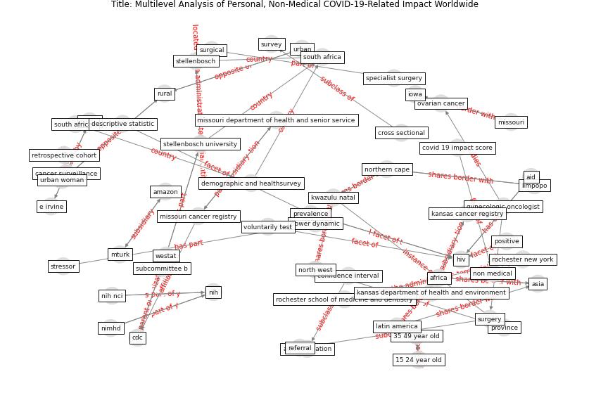

# Article: __Multilevel Analysis of Personal, Non-Medical COVID-19-Related Impact Worldwide__ (dye_multilevel_2020)

* [10.1016/j.annepidem.2020.08.060](https://doi.org/10.1016/j.annepidem.2020.08.060)
* Cluster: [health-building](cluster_9)

## Keywords

* [missouri](keyword_missouri), [iowa](keyword_iowa), [asia](keyword_asia), [kansas](keyword_kansas), [ovarian cancer](keyword_ovarian_cancer), [gynecologic oncologist](keyword_gynecologic_oncologist), [oncologist](keyword_oncologist), [kwazulu - natal](keyword_kwazulu_-_natal), [university of iowa](keyword_university_of_iowa), [gynecologic](keyword_gynecologic), urban woman, rural, africa, individual - level factor, stellenbosch university

## Keywords at large

* [iowa](keyword_iowa), [missouri](keyword_missouri), [asia](keyword_asia), [kansas](keyword_kansas), [ovarian cancer](keyword_ovarian_cancer), [gynecologic oncologist](keyword_gynecologic_oncologist), [kwazulu - natal](keyword_kwazulu_-_natal), [gynecologic](keyword_gynecologic), [oncologist](keyword_oncologist), [university of iowa](keyword_university_of_iowa)

## Concepts

 

### Closest articles 

* [Rotating groups at work, school best against COVID-19
spread: Study](article_afp_rotating_2021)
* [Assessing the health and hygiene performance of apartment buildings](article_ho_assessing_2004)
* [hseie_algorithms_2021](article_hseie_algorithms_2021)
* [Construction of a Linked Data Set of COVID-19 Knowledge Graphs: Development and Applications](article_wang_construction_2022)
* [Infodemic and the spread of fake news in the COVID-19-era](article_orso_infodemic_2020)
* [Response to COVID-19 in Taiwan](article_wang_response_2020)
* [Reframe how to serve your community in the midst of a pandemic](article_sutton_reframe_2020)
* [A Platform for Citizen Cooperation during the COVID-19 Pandemic in RN, Brazil](article_de_araujo_platform_2020)
* [How loneliness is talked about in social media during COVID-19 pandemic: Text mining of 4,492 Twitter feeds](article_koh_how_2022)
* [Case Study on Finnish TVETA Resilient Model of
Training During COVID-19](article_unesco_case_2021)

