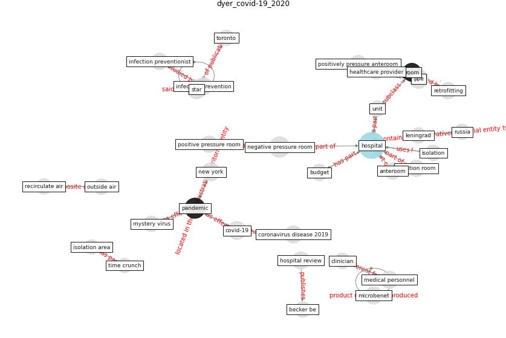

# Article: COVID-19 Forced Hospitals to Build NegativePressure Rooms Fast (dyer_covid-19_2020)

* [https://www.infectioncontroltoday.com/view/covid-19-forced-hospitals-build-negative-pressure-rooms-fast](https://www.infectioncontroltoday.com/view/covid-19-forced-hospitals-build-negative-pressure-rooms-fast)
* Year: 2020
* Cluster: [ward-patient](cluster_15)

## Keywords

 * air handling unit, air pressure, alexandria, [anteroom](keyword_anteroom), bay area temporary ward, becker s, brigham woman s, brigham women s faulkner hospital, budget, [camera](keyword_camera), chen x, [china](keyword_china), class ii, cleveland, cleveland clinic, clinical topic, clinician, columbus, component, [covid-19](keyword_covid-19), disaster response, duct tape, echo press, fan belt, fitzemeyer, fitzemeyer tocci, force out, health facility management, [health system](keyword_health_system), [healthcare](keyword_healthcare), healthcare provider, hepa filter, [hospital](keyword_hospital), hospital review, hospital surge capacity plan, [infection control](keyword_infection_control), infection prevention, infection preventionist, [infectious disease](keyword_infectious_disease), installation, [isolation](keyword_isolation), isolation area, isolation room, isolation ward, layout, leningrad, lifesave, massive number, [medical](keyword_medical), medical personnel, microbenet, minnesota, minnesota health system releasessurge plan, mystery virus, nasa, [negative air machine](keyword_negative_air_machine), negative isolation, negative pressure isolation, [negative pressure room](keyword_negative_pressure_room), [new york](keyword_new_york), [new york city](keyword_new_york_city), nurse s glove, nursing home, observe system, outside air, [pandemic](keyword_pandemic), pandemic preparedness, [personal protective equipment](keyword_personal_protective_equipment), pii, plague, plastic, plastic sheeting, positive pressure room, positively pressure anteroom, [pressure](keyword_pressure), pressure room, protection, pump, recirculate, recirculate air, recirculate room air, retrofitting, [room](keyword_room), [russia](keyword_russia), [staff](keyword_staff), [star](keyword_star), subhash ss, suffern, time crunch, tocci, [toronto](keyword_toronto), toronto s, treat patient, troubleshooting, unit, [ventilation](keyword_ventilation), wcmh, weapon, woman s faulkner hospital, zipper

## Concepts

 

## Neighbours

### Closest articles

* Rapid expansion of temporary, reliable airborne-infection isolation rooms with negative air machines for critical COVID-19 patients - [LINK](article_lee_rapid_2020)
* Toilets dominate environmental detection of SARS-CoV-2 virus in a hospital - [LINK](article_ding_toilets_2020)
* Aerosol and Surface Distribution of Severe Acute Respiratory Syndrome Coronavirus 2 in Hospital Wards, Wuhan, China, 2020 - [LINK](article_guo_aerosol_2020)
* SARS-CoV-2 RNA detection of hospital isolation wards hygiene monitoring during the Coronavirus Disease 2019 outbreak in a Chinese hospital - [LINK](article_wang_sars-cov-2_2020)
* Air, Surface Environmental, and Personal Protective Equipment Contamination by Severe Acute Respiratory Syndrome Coronavirus 2 (SARS-CoV-2) From a Symptomatic Patient - [LINK](article_ong_air_2020)
* Real-world data show that filters clean COVID-causing virus from air - [LINK](article_thompson_real-world_2021)
* First confirmed detection of SARS-CoV-2 in untreated wastewater in Australia: A proof of concept for the wastewater surveillance of COVID-19 in the community - [LINK](article_ahmed_first_2020)
* Presence of SARS-Coronavirus-2 RNA in Sewage and Correlation with Reported COVID-19 Prevalence in the Early Stage of the Epidemic in The Netherlands - [LINK](article_medema_presence_2020)
* Persistence of coronaviruses on inanimate surfaces and their inactivation with biocidal agents - [LINK](article_kampf_persistence_2020)

### Closest BPs

* Negative pressure rooms - [LINK](bp_13)
* Installing high-efficiency air filters - [LINK](bp_11)
* Monitoring of wastewater [CID] - [LINK](bp_21)
