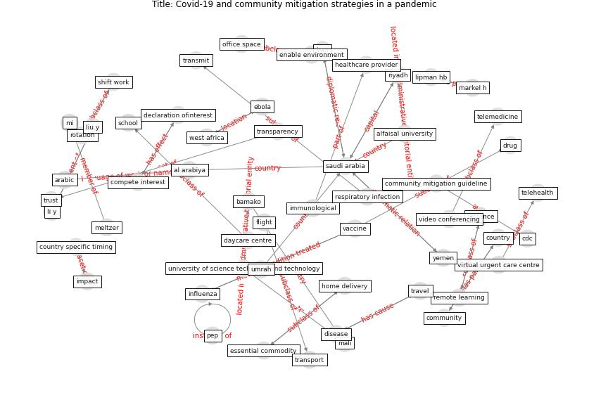

# Article: Covid-19 and community mitigation strategies in a pandemic (ebrahim_covid-19_2020)

* Source: [10.1136/bmj.m1066](https://doi.org/10.1136/bmj.m1066)
* Year: 2020
* Cluster: [health-pandemic](cluster_4)

## Keywords

 * adult, al arabiya, alarabiya, alfaisal university, anthropologist, arabic, bamako, [cdc](keyword_cdc), child, cluster of infection, [community](keyword_community), community mitigation guideline, compete interest, [country](keyword_country), country specific timing, covid 19 outbreak, covid 19 outbreak on the diamond princess cruiseship, [covid-19](keyword_covid-19), curb export, curb export of key drug, daycare, daycare centre, declaration of psynetinterest, declaration ofinterest, determinant, diamond princess, diamond princess cruiseship, [disease](keyword_disease), disease transmission, distance, drug, ebola, ebola outbreak, enable environment, [epidemic](keyword_epidemic), essential commodity, [fake news](keyword_fake_news), family, family cluster, flight, gathering, gathering and event, [health system](keyword_health_system), [healthcare](keyword_healthcare), healthcare provider, home delivery, immunological, [impact](keyword_impact), [india](keyword_india), [infection](keyword_infection), [influenza](keyword_influenza), iran, kentucky, key fixmedeterminant, li y, licence, lipman hb, [liu y](keyword_liu_y), mali, markel h, meltzer, mi, mitigation guideline, music festival, office space, [pep](keyword_pep), railway, remote learning, respiratory infection, [riyadh](keyword_riyadh), rotation, rotation schedule, rumour, [saudi arabia](keyword_saudi_arabia), [school](keyword_school), school closure, school meal, schunk m, seasonal influenza vaccination, see right and reprint, shift work, sothmann p, stop all export, [telehealth](keyword_telehealth), telemedicine, transmit, transparency, [transport](keyword_transport), [travel](keyword_travel), trust, umrah, university of science technique and technology, urgent care centre, [vaccine](keyword_vaccine), video conferencing, viral transmission, virtual urgent care centre, west africa, world health organization, yemen

## Concepts

 

## Neighbours

### Closest articles

* Coronavirus disease 2019: The harms of exaggerated information and non‐evidence‐based measures - [LINK](article_ioannidis_coronavirus_2020)
* Response to COVID-19 in Taiwan - [LINK](article_wang_response_2020)
* The Socio-Spatial Determinants of COVID-19 Diffusion: The Impact of Globalisation, Settlement Characteristics and Population - [LINK](article_sigler_socio-spatial_2020)
*  - [LINK](article_mehtab_alam_role_2021)
* The effect of human mobility and control measures on the COVID-19 epidemic in China - [LINK](article_kraemer_effect_2020)
* COVID-19 and social inequalities: a complex and dynamic interaction - [LINK](article_quantin_covid-19_2022)
* The impact of COVID-19 and strategies for mitigation and suppression in low- and middle-income countries - [LINK](article_walker_impact_2020)
* Study of COVID-19 pandemic in London (UK) from urban context - [LINK](article_ghosh_study_2020)
* Open-source analytics tools for studying the COVID-19 coronavirus outbreak - [LINK](article_wu_open-source_2020)

### Closest BPs

* Resilience in staffing and skills training - [LINK](bp_12)
* Air Cleaning Plants - [LINK](bp_15)
* Monitoring of wastewater [CID] - [LINK](bp_21)
