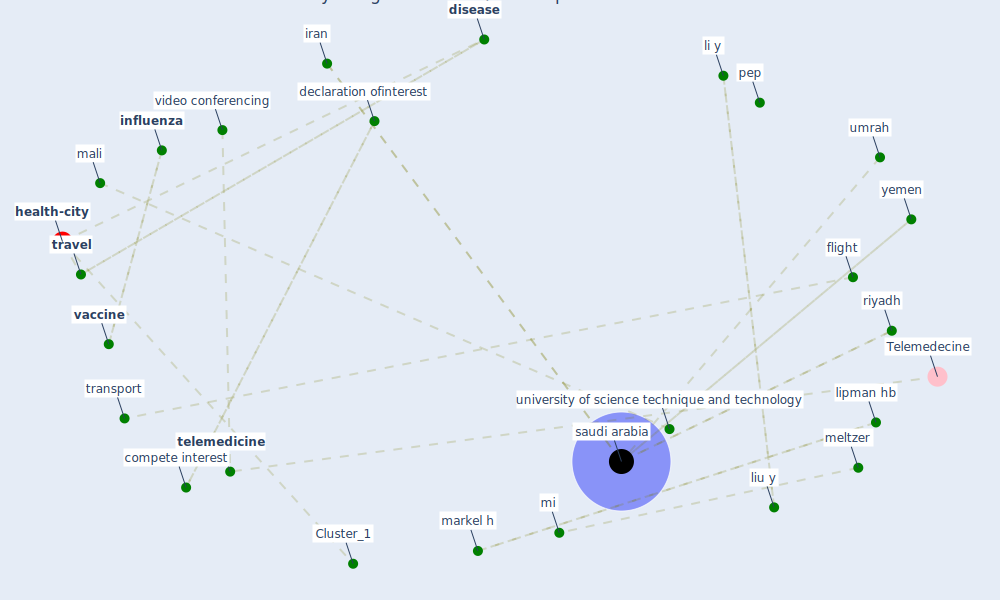

# Article: Covid-19 and community mitigation strategies in a pandemic (ebrahim_covid-19_2020)

* Source: [10.1136/bmj.m1066](https://doi.org/10.1136/bmj.m1066)
* Year: 2020
* Cluster: [health-city](cluster_1)

## Keywords

 * absolute travel ban, adult, alarabiya, anthropologist, arabic, bamako, [cdc](keyword_cdc), [child](keyword_child), cluster of infection, [community](keyword_community), community mitigation guideline, compete interest, [country](keyword_country), country specific timing, covid 19 outbreak, covid 19 outbreak on the diamond princess cruiseship, [covid-19](keyword_covid-19), curb, curb export, curb export of key drug, daycare, daycare centre, declaration of psynetinterest, declaration ofinterest, determinant, diamond princess, diamond princess cruiseship, [disease](keyword_disease), disease transmission, distance, [drug](keyword_drug), ebola, ebola outbreak, enable environment, [epidemic](keyword_epidemic), [fake news](keyword_fake_news), family, family cluster, flight, gathering, gathering and event, [health system](keyword_health_system), [healthcare](keyword_healthcare), healthcare provider, immunological, [impact](keyword_impact), [india](keyword_india), [infection](keyword_infection), [influenza](keyword_influenza), iran, kentucky, key fixmedeterminant, [li y](keyword_li_y), licence, lipman hb, [liu y](keyword_liu_y), mali, markel h, meltzer, mi, mitigation guideline, music festival, office space, overburden everywhere, [pathogen](keyword_pathogen), [pep](keyword_pep), qom, railway, reactive school closure, remote learning, [respiratory](keyword_respiratory), respiratory infection, riyadh, rotation, rotation schedule, rumour, [saudi arabia](keyword_saudi_arabia), [school](keyword_school), school closure, school meal, schunk m, see right and reprint, shift work, sothmann p, stop all export, [telehealth](keyword_telehealth), [telemedicine](keyword_telemedicine), transmit, transparency, [transport](keyword_transport), [travel](keyword_travel), trust, umrah, university of science technique and technology, urgent care centre, [vaccine](keyword_vaccine), video conferencing, west africa, [world health organization](keyword_world_health_organization), yemen

## Concepts

 

## Neighbours

### Closest articles

* Coronavirus disease 2019: The harms of exaggerated information and non‐evidence‐based measures - [LINK](article_ioannidis_coronavirus_2020)
* Overview of the mitigation strategies for COVID-19 pandemic - [LINK](article_ads_overview_2020)
* Response to COVID-19 in Taiwan - [LINK](article_wang_response_2020)
* COVID-19: A new digital dawn? - [LINK](article_robbins_covid-19_2020)
* Infodemic and the spread of fake news in the COVID-19-era - [LINK](article_orso_infodemic_2020)
* Telehealth overpromises during the Covid-19 pandemic - [LINK](article_ostherr_telehealth_2020)
*  - [LINK](article_mehtab_alam_role_2021)
* Management of the COVID-19 pandemic: challenges, practices, and organizational support - [LINK](article_hossny_management_2022)
* Coronavirus: Can artificial intelligence be smart enough to detect fake news? - [LINK](article_tong_coronavirus_2020)
* Emergency Healthcare Facilities: Managing Design in a Post Covid-19 World - [LINK](article_marinelli_emergency_2020)

### Closest BPs

* Blueprint: Resilience in staffing and skills training - [LINK](bp_12)
* Blueprint: Negative pressure rooms - [LINK](bp_13)
* Blueprint: Installing UV in ductwork - [LINK](bp_10)
