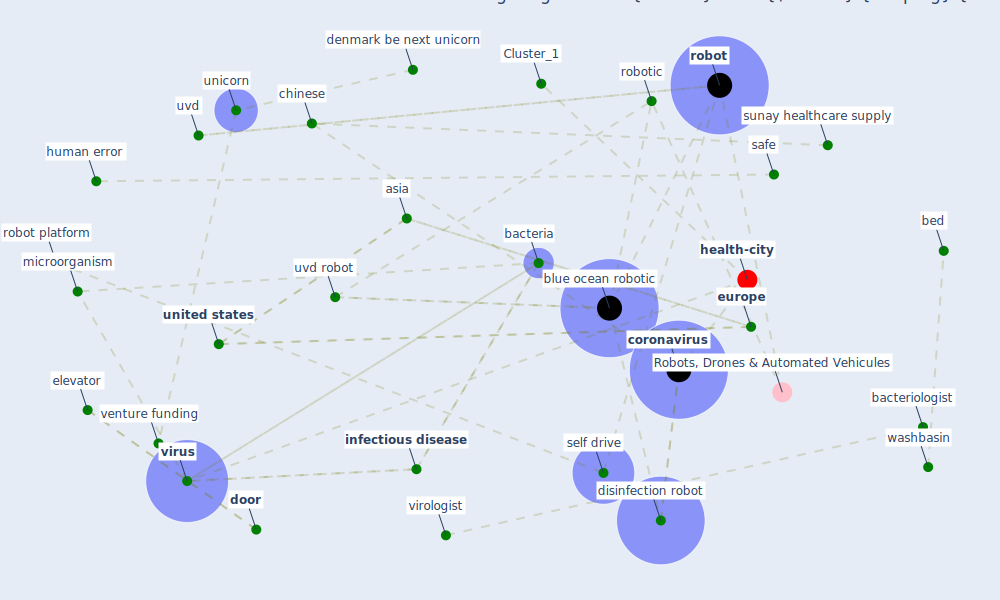

# Article: Danish disinfection robots save lives in the fight against the Corona virus \textbar Shaping Europe’s digital future (ec_views_danish_2020)

* [https://digital-strategy.ec.europa.eu/en/news/danish-disinfection-robots-save-lives-fight-against-corona-virus](https://digital-strategy.ec.europa.eu/en/news/danish-disinfection-robots-save-lives-fight-against-corona-virus)
* Year: 2020
* Cluster: [air-sars](cluster_9)

## Keywords

 * [airport](keyword_airport), asia, [bacteria](keyword_bacteria), bacteriologist, bed, blue ocean robotic, [chinese](keyword_chinese), chinese market, [coronavirus](keyword_coronavirus), [danish](keyword_danish), danish region, [denmark](keyword_denmark), denmark be next unicorn, denmark s next unicorn, [disinfection](keyword_disinfection), disinfection robot, door, elevator, [europe](keyword_europe), handle, [healthcare](keyword_healthcare), [hospital](keyword_hospital), human error, [industry](keyword_industry), [infectious disease](keyword_infectious_disease), [microorganism](keyword_microorganism), patient bed, railway, [robot](keyword_robot), robot platform, [robotic](keyword_robotic), safe, self drive, sunay, sunay healthcare supply, unicorn, [united states](keyword_united_states), user friendly, uvd, uvd robot, venture funding, virologist, [virus](keyword_virus), washbasin

## Concepts

 

## Neighbours

### Closest articles

* Combating COVID-19—The role of robotics in managing public health and infectious diseases - [LINK](article_yang_combating_2020)
* Drones. Disinfecting robots. Supercomputers. The coronavirus outbreak is a test for China's tech industry \textbar CNN Business - [LINK](article_wang_drones_2020)
* COVID-19 could be a seasonal illness with higher risk in winter: Reduced humidity linked to increased COVID-19 risk - [LINK](article_university_of_sydney_covid-19_2020)
* China adapts survey drones to enforce world’s largest quarantine - [LINK](article_liu_china_2020)
* Mechanistic insights into the effect of humidity on airborne influenza virus survival, transmission and incidence - [LINK](article_marr_mechanistic_2019)
* Effects of temperature and humidity on the spread of COVID-19: A systematic review - [LINK](article_mecenas_effects_2020)
* Indirect effects of COVID-19 on the environment - [LINK](article_zambrano-monserrate_indirect_2020)
* Nurture to nature via COVID-19, a self-regenerating environmental strategy of environment in global context - [LINK](article_paital_nurture_2020)
* Understanding the role of urban design in disease spreading - [LINK](article_brizuela_understanding_2019)

### Closest BPs

* Blueprint: Monitoring of wastewater - [LINK](bp_21)
* Blueprint: Smart Locker System - [LINK](bp_1)
* Blueprint: Negative pressure rooms - [LINK](bp_13)
