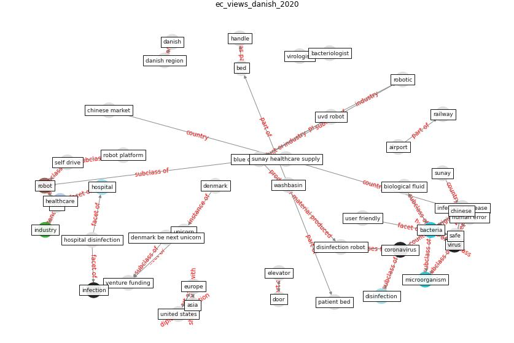

# Article: __Danish disinfection robots save lives in the fight against the Corona virus \textbar Shaping Europe’s digital future__ (ec_views_danish_2020)

* URL: [https://digital-strategy.ec.europa.eu/en/news/danish-disinfection-robots-save-lives-fight-against-corona-virus](https://digital-strategy.ec.europa.eu/en/news/danish-disinfection-robots-save-lives-fight-against-corona-virus)
* Year: 2020
* Abstract: Back in 2014-2017, Blue Ocean Robotics created a
self-driving disinfection robot in a pre-commercial
procurement for a buyers group from several Danish regions.
Since then, the Danish start-up attracted \$48,7M USD
Venture Funding, experienced a steep growth to over dkk 850
million valuation and +200 employees, and is tipped to
become Denmark’s next unicorn. The company already sold
its disinfection robot to over 60 countries that are now
using it to combat the Corona virus.

## Keywords

[bacteria](keyword_bacteria), [virus](keyword_virus), [robot](keyword_robot), [microorganism](keyword_microorganism)

## Concepts

 

