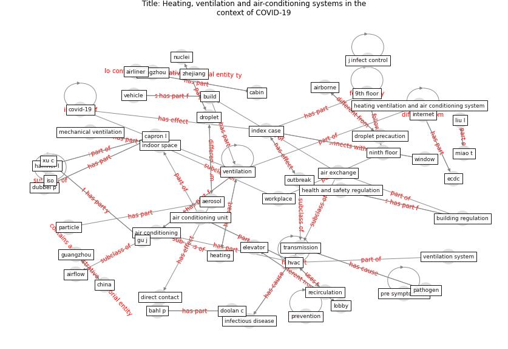

# Article: __Heating, ventilation and air-conditioning systems in the context of COVID-19__ (ecdc_heating_2020)

* URL: [https://www.ecdc.europa.eu/sites/default/files/documents/Ventilation-in-the-context-of-COVID-19.pdf](https://www.ecdc.europa.eu/sites/default/files/documents/Ventilation-in-the-context-of-COVID-19.pdf)
* Year: 2020

## Keywords

* [ventilation](keyword_ventilation), [covid-19](keyword_covid-19), [transmission](keyword_transmission), [hvac](keyword_hvac), [index case](keyword_index_case), [air conditioning](keyword_air_conditioning), [china](keyword_china), [hamner l](keyword_hamner_l), [ecdc](keyword_ecdc), air conditioning unit, [guangzhou](keyword_guangzhou), indoor space, 9th floor, [aerosol](keyword_aerosol), [droplet](keyword_droplet)

## Keywords at large

* [ventilation](keyword_ventilation), [covid-19](keyword_covid-19), [transmission](keyword_transmission), [hvac](keyword_hvac), [index case](keyword_index_case), [air conditioning](keyword_air_conditioning), [china](keyword_china), [hamner l](keyword_hamner_l), [ecdc](keyword_ecdc), [guangzhou](keyword_guangzhou)

## Concepts

 

### Closest articles 

* [Ventilation use in nonmedical settings during COVID-19: Cleaning protocol, maintenance, and recommendations](article_nembhard_ventilation_2020)
* [Review and comparison of HVAC operation guidelines in different countries during the COVID-19 pandemic](article_guo_review_2021)
* [How can airborne transmission of COVID-19 indoors be minimised?](article_morawska_how_2020)
* [A review of facilities management interventions to mitigate respiratory infections in existing buildings](article_zhang_review_2022)
* [morawska_how_2020-1](article_morawska_how_2020-1)
* [ASHRAE Position Document on Infectious
Aerosols](article_ashrae_ashrae_2022)
* [Environmental factors involved in SARS-CoV-2 transmission: effect and role of indoor environmental quality in the strategy for COVID-19 infection control](article_azuma_environmental_2020)
* [The ventilation of buildings and other mitigating measures for COVID-19: a focus on wintertime](article_burridge_ventilation_2021)
* [2019 Novel Coronavirus (COVID-19) Pandemic: Built Environment Considerations To Reduce Transmission](article_dietz_2019_2020)
* [Methods for air cleaning and protection of building occupants from airborne pathogens](article_bolashikov_methods_2009)

