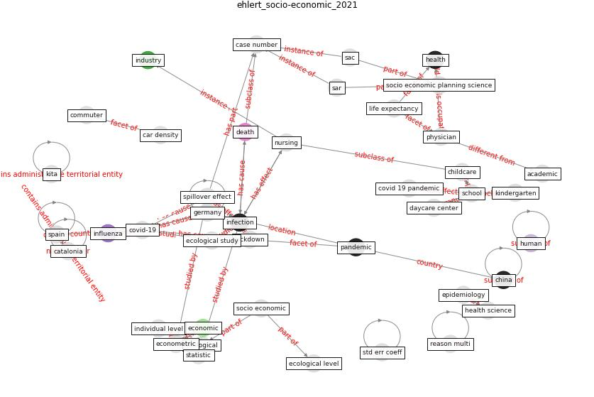

# Article: The socio-economic determinants of COVID-19: A spatial analysis of German county level data (ehlert_socio-economic_2021)

* Source: [10.1016/j.seps.2021.101083](https://doi.org/10.1016/j.seps.2021.101083)
* Year: 2021
* Cluster: [city-health](cluster_14)

## Keywords

 * academic, age, analyse, ben shlomo y, [berlin](keyword_berlin), buja a, car density, case number, catalonia, child, childcare, [china](keyword_china), clinical, coeff, commuter, contact restriction, copd, [country](keyword_country), [covid 19 pandemic](keyword_covid_19_pandemic), [covid-19](keyword_covid-19), [datum](keyword_datum), day care, daycare center, death, demography, ecological, ecological level, ecological study, econometric, [economic](keyword_economic), [economy](keyword_economy), eocene, [epidemiology](keyword_epidemiology), european, [germany](keyword_germany), group, group level, [health](keyword_health), health science, heart failure, high education, hospital bed, [human](keyword_human), income, income unempl, [indirect effect](keyword_indirect_effect), individual, individual level, [industry](keyword_industry), [infection](keyword_infection), [influenza](keyword_influenza), [interaction](keyword_interaction), interaction effect, international perspective, iran, kindergarten, kita, life expectancy, [lockdown](keyword_lockdown), lockdown measure, mean age, mechanism of action, natali I, [network](keyword_network), [nursing](keyword_nursing), nursing home, ol model, [pandemic](keyword_pandemic), per, physician, [population](keyword_population), population density, population level, pupil, rate per, reason multi, region, regional, robert koch institut, sac, sar model, [school](keyword_school), section 3, service, service per, significant, [social](keyword_social), socio economic, socio economic factor, socio economic planning science, [spain](keyword_spain), spatial model, spillover, [spillover effect](keyword_spillover_effect), [spread](keyword_spread), statistic, std err coeff, symbol, technical, variable

## Concepts

 

## Neighbours

### Closest articles

* Treating two pandemics for the price of one: Chronic and infectious disease impacts of the built and natural environment - [LINK](article_frank_treating_2021)
* The Socio-Spatial Determinants of COVID-19 Diffusion: The Impact of Globalisation, Settlement Characteristics and Population - [LINK](article_sigler_socio-spatial_2020)
* COVID-19 and the rise of intimate partner violence - [LINK](article_aguero_covid-19_2021)
* Mental health economics: A prospective study on psychological flourishing and associations with healthcare costs and sickness benefit transfers in Denmark - [LINK](article_santini_mental_2021)
* The impact of COVID-19 and strategies for mitigation and suppression in low- and middle-income countries - [LINK](article_walker_impact_2020)
* Association of built environment attributes with the spread of COVID-19 at its initial stage in China - [LINK](article_li_association_2021)
* Multilevel Analysis of Personal, Non-Medical COVID-19-Related Impact Worldwide - [LINK](article_dye_multilevel_2020)
* Eviction, Health Inequity, and the Spread of COVID-19: Housing Policy as a Primary Pandemic Mitigation Strategy - [LINK](article_benfer_eviction_2021)
* What has been the impact of the COVID-19 pandemic on immigrants? An update on recent evidence - [LINK](article_oecd_what_2022)
* Urban design attributes and resilience: COVID-19 evidence from New York City - [LINK](article_yang_urban_2021)

### Closest BPs

* Blueprint: Resilience in staffing and skills training - [LINK](bp_12)
* Blueprint: Public places as information points - [LINK](bp_8)
* Blueprint: Tender support at building stage - [LINK](bp_9)
