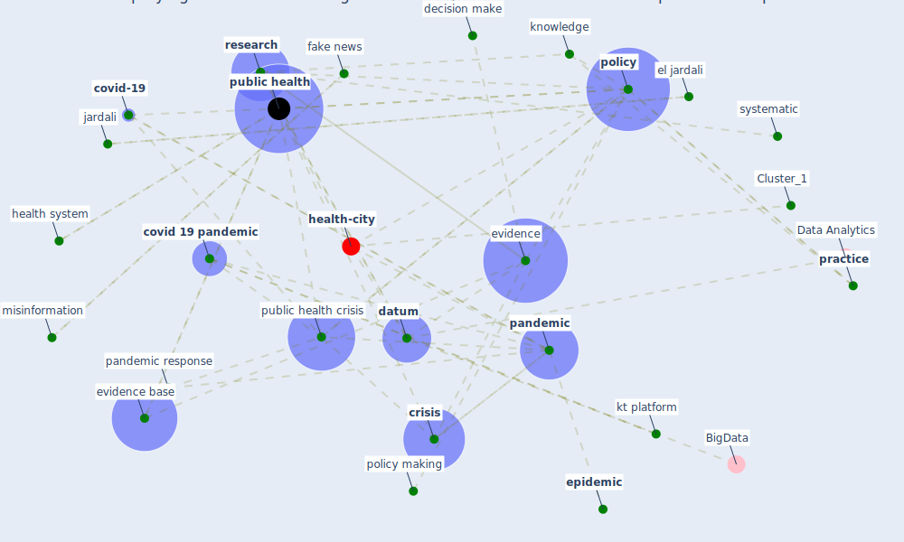

# Article: Amplifying the role of knowledge translation platforms in the COVID-19 pandemic response (el-jardali_amplifying_2020)

* Source: [10.1186/s12961-020-00576-y](https://doi.org/10.1186/s12961-020-00576-y)
* Year: 2020
* Cluster: [health-city](cluster_1)

## Keywords

 * allen c, american university of beirut, beirut, bias, bottom up, breckon j, cameroon, campbell s, carbone, chaff, complexity, coronavirus disease, correspondence, [covid 19 pandemic](keyword_covid_19_pandemic), [covid-19](keyword_covid-19), [crisis](keyword_crisis), [datum](keyword_datum), davy p, death, decision make, decision make process, decision maker, decisionmake, [digital](keyword_digital), disseminate the evidence, dissemination, ecdc, el jardali, [epidemic](keyword_epidemic), epidemiologist, [evidence](keyword_evidence), evidence base, [fake news](keyword_fake_news), [government](keyword_government), hamid m, hamilton, [health](keyword_health), health policy, [health system](keyword_health_system), [influenza](keyword_influenza), infodemic, [information](keyword_information), intention, [italy](keyword_italy), jardali, journalist, kasonde jm, [knowledge](keyword_knowledge), kt, kt platform, lavis jn, lebanon, lewin s, life, [low](keyword_low), madjou g, [material](keyword_material), middle income country, [misinformation](keyword_misinformation), [mitigation](keyword_mitigation), [network](keyword_network), ongolo zogo, ontario, [organisation](keyword_organisation), oxman ad, [pandemic](keyword_pandemic), pandemic cycle, pandemic response, plain language, [plan](keyword_plan), [platform](keyword_platform), [policy](keyword_policy), policy making, policy making process, postpandemic phase, [practice](keyword_practice), [prevention](keyword_prevention), prioritise, [public health](keyword_public_health), public health crisis, rapid response service, repository, [research](keyword_research), research evidence, [response](keyword_response), science, sewankambo nk, source of evidence, [stakeholder](keyword_stakeholder), systematic, systematic rapid review, systematic review, top down, tsolova s, uganda, uncertainty, value, [virus](keyword_virus), wheat, world health organ

## Concepts

 

## Neighbours

### Closest articles

* From Viral City to Smart City: Learning from Pandemic Experiences - [LINK](article_sakellarides_viral_2020)
* 10 Adaptive Measures for Public Places to face the COVID 19 Pandemic Outbreak - [LINK](article_cheshmehzangi_10_2020)
* COVID-19 Lockdown: Housing Built Environment’s Effects on Mental Health - [LINK](article_amerio_covid-19_2020)
* Psychological Effects of Home Confinement and Social Distancing Derived from COVID-19 in the General Population—A Systematic Review - [LINK](article_rodriguez-fernandez_psychological_2021)
* Home garden use during COVID-19: Associations with physical and mental wellbeing in older adults - [LINK](article_corley_home_2021)
* The psychological impact of COVID-19 on the mental health in the general population - [LINK](article_serafini_psychological_2020)
* The City Under COVID‐19: Podcasting As Digital Methodology - [LINK](article_rogers_city_2020)
* Mobility Behaviour in View of the Impact of the COVID-19 Pandemic—Public Transport Users in Gdansk Case Study - [LINK](article_przybylowski_mobility_2021)
* Responsible Transport: A post-COVID agenda for transport policy and practice - [LINK](article_budd_responsible_2020)
* Green spaces, especially forest, linked to lower SARS-CoV-2 infection rates: A one-year nationwide study - [LINK](article_jiang_green_2021)

### Closest BPs

* Blueprint: Resilience in staffing and skills training - [LINK](bp_12)
* Blueprint: Monitoring of wastewater - [LINK](bp_21)
* Blueprint: Installing high-efficiency air filters - [LINK](bp_11)
