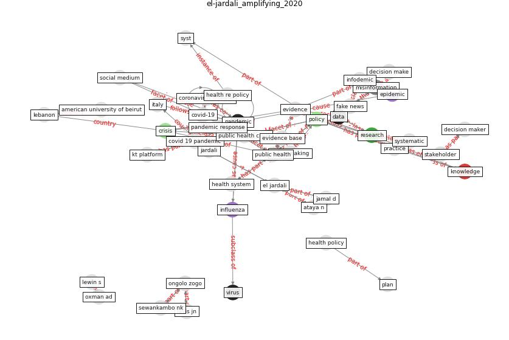

# Article: __Amplifying the role of knowledge translation platforms in the COVID-19 pandemic response__ (el-jardali_amplifying_2020)

* [10.1186/s12961-020-00576-y](https://doi.org/10.1186/s12961-020-00576-y)
* Cluster: [health-city](cluster_3)

## Keywords

[pandemic](keyword_pandemic), [policy](keyword_policy), [research](keyword_research), [crisis](keyword_crisis)

## Abstract

Abstract The COVID-19 pandemic presents the worst public
health crisis in recent history. The response to the
COVID-19 pandemic has been challenged by many factors,
including scientific uncertainties, scarcity of relevant
research, proliferation of misinformation and fake news,
poor access to actionable evidence, time constraints, and
weak collaborations among relevant stakeholders. Knowledge
translation (KT) platforms, composed of organisations,
initiatives and networks supporting evidence-informed
policy-making, can play an important role in providing
relevant and timely evidence to inform pandemic responses
and bridge the gap between science, policy, practice and
politics. In this Commentary, we highlight the emerging
roles of KT platforms in light of the COVID-19 pandemic. We
also reflect on the lessons learned from the efforts of a
KT platform in a middle-income country to inform
decision-making and practice during the COVID-19 pandemic.
The lessons learned can be integrated into strengthening
the role, structures and mandates of KT platforms as hubs
for trustworthy evidence that can inform policies and
practice during public health crises and in promoting their
integration and institutionalisation within the
policy-making processes.

## Concepts

 

### References 

* [Coronavirus disease 2019: The harms of exaggerated
information and non‐evidence‐based measures](article_ioannidis_coronavirus_2020)
* [Infodemic and the spread of fake news in the
COVID-19-era](article_orso_infodemic_2020)

### Cited by 

* [The changes in the effects of social media use of
Cypriots due to COVID-19 pandemic](article_kaya_changes_2020)
