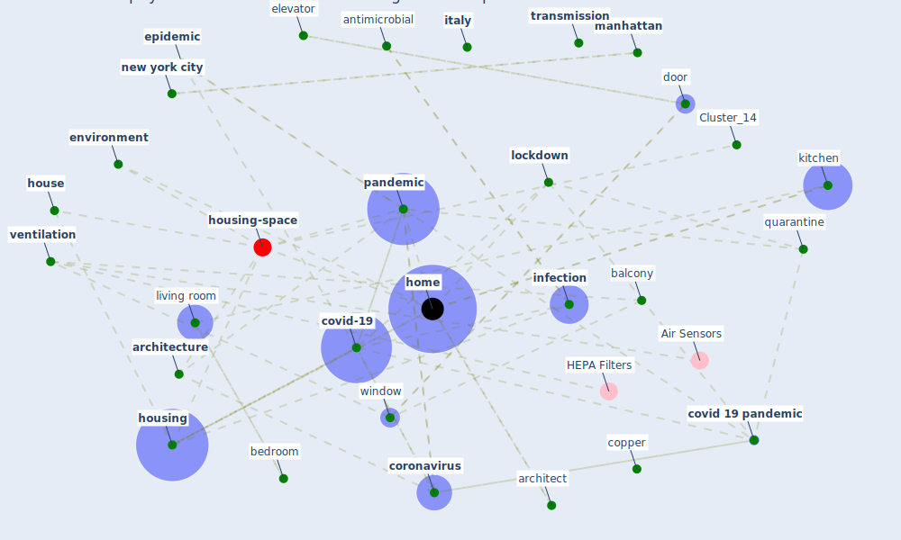

# Article: Prophylactic Architecture: Formulating the Concept of Pandemic-Resilient Homes (elrayies_prophylactic_2022)

* Source: [10.3390/buildings12070927](https://doi.org/10.3390/buildings12070927)
* Year: 2022
* Cluster: [housing-space](cluster_14)

## Keywords

 * [aerosol](keyword_aerosol), [antimicrobial](keyword_antimicrobial), [apartment](keyword_apartment), arb arb, arboretum, [architect](keyword_architect), architectural, [architecture](keyword_architecture), architizer, [australia](keyword_australia), [balcony](keyword_balcony), bathroom, [bedroom](keyword_bedroom), [brazil](keyword_brazil), [breeam](keyword_breeam), [build](keyword_build), build j, carpet, [china](keyword_china), [comfort](keyword_comfort), conegliano, contactless technology, [copper](keyword_copper), [coronavirus](keyword_coronavirus), [corridor](keyword_corridor), [covid 19 pandemic](keyword_covid_19_pandemic), [covid-19](keyword_covid-19), [design](keyword_design), [disease](keyword_disease), [disinfection](keyword_disinfection), door, drink water, [economy](keyword_economy), elevator, [energy](keyword_energy), entertainment, [environment](keyword_environment), [epidemic](keyword_epidemic), family, fan, faucet, floor plan, florianópolis, food, furniture, green garden, [health](keyword_health), [home](keyword_home), home design, [house](keyword_house), [housing](keyword_housing), houston, [hvac](keyword_hvac), [indoor](keyword_indoor), [infection](keyword_infection), [infectious disease](keyword_infectious_disease), [italy](keyword_italy), java, kitchen, lifestyle, [live](keyword_live), living room, lobby, [lockdown](keyword_lockdown), [low](keyword_low), [manhattan](keyword_manhattan), marco, [mental](keyword_mental), middle income family, modular system, mohame, [new south wale](keyword_new_south_wale), [new york city](keyword_new_york_city), okely, [pandemic](keyword_pandemic), pandemic resilient home, post-pandemic, [psychological](keyword_psychological), [public housing](keyword_public_housing), quarantine, quarantine room, rawtani, relative humidity, [risk](keyword_risk), silver, [society](keyword_society), stair, [sustainability](keyword_sustainability), [sustainable architecture](keyword_sustainable_architecture), [sustainable development goal](keyword_sustainable_development_goal), [switzerland](keyword_switzerland), [temperature](keyword_temperature), [toilet](keyword_toilet), toilet paper, [transmission](keyword_transmission), urban design, [ventilation](keyword_ventilation), [virus](keyword_virus), [window](keyword_window), zhang

## Concepts

 

## Neighbours

### Closest articles

*  - [LINK](article_dalessandro_covid-19_2020)
* How is COVID-19 Experience Transforming Sustainability Requirements of Residential Buildings? A Review - [LINK](article_tokazhanov_how_2020)
* How our homes impact our health: using a COVID-19 informed approach to examine urban apartment housing - [LINK](article_peters_how_2020)
* Towards Resilient Residential Buildings and Neighborhoods in Light of COVID-19 Pandemic—The Scenario of Podgorica, Montenegro - [LINK](article_bojovic_towards_2022)
* COVID-19 and Green Housing: A Review of Relevant Literature - [LINK](article_kaklauskas_covid-19_2021)
* RESIDENTIAL ARCHITECTURE IN A POST-PANDEMIC WORLD: IMPLICATIONS OF COVID-19 FOR NEW CONSTRUCTION AND FOR ADAPTING HERITAGE BUILDINGS - [LINK](article_spennemann_residential_2021)
* COVID-19 Could Leverage a Sustainable Built Environment - [LINK](article_pinheiro_covid-19_2020)
* Designing for COVID-2x: Reflecting on Future-Proofing Human Habitation for the Inevitable Next Pandemic - [LINK](article_spennemann_designing_2022)
* Adaptive Design of the Built Environment to Mitigate the Transmission Risk of COVID-19 - [LINK](article_ara_dilshad_shangi_adaptive_2020)
* Houses amid COVID-19: Environmental challenges and design adaptation - [LINK](article_hizra_houses_2021)

### Closest BPs

* Blueprint: Building Adaptation during a pandemic - [LINK](bp_14)
* Blueprint: Tracking and enforcing use of Personal Protective Equipment - [LINK](bp_23)
* Blueprint: Architecture design - [LINK](bp_2)
