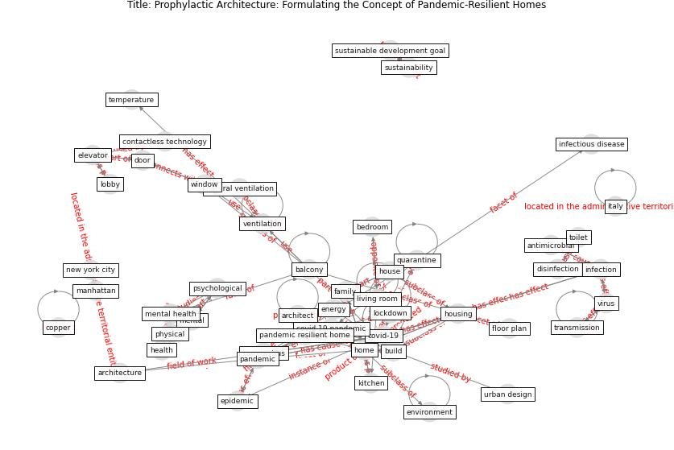

# Article: __Prophylactic Architecture: Formulating the Concept of Pandemic-Resilient Homes__ (elrayies_prophylactic_2022)

* [10.3390/buildings12070927](https://doi.org/10.3390/buildings12070927)
* Cluster: [space-urban](cluster_13)

## Keywords

[pandemic](keyword_pandemic), [home](keyword_home), [ventilation](keyword_ventilation), [housing](keyword_housing), [epidemic](keyword_epidemic), [infection](keyword_infection)

## Abstract

The lockdown instituted during the COVID-19 pandemic has
drawn the world’s attention to the importance of homes as
integrated structures for practicing all aspects of life.
The home has been transformed from a mere place to live
into a complete piece of infrastructure accommodating all
activities of life, including study, work, shopping,
exercise, entertainment, and even telehealth. Although
quarantines were necessary to protect against viral
infection, we have faced social and psychological
challenges due to the failure of the current home design to
accommodate the new lockdown lifestyle during the pandemic.
Thus, this study aims to set a foundation for the
development and design of resilient homes in a
post-quarantine world by establishing a comprehensive
framework for quarantine-resilient homes. The framework was
established on the basis of the relevant literature and
proposals from architects and experts. It brings a
perspective to the future requirements of homes so as to
provide architects, stakeholders, and policymakers with the
appropriate knowledge to mitigate the impact of lockdowns
on mental health and well-being in residential buildings by
focusing on the physical and architectural environment.

## Concepts

 

### References 

* [How can airborne transmission of COVID-19 indoors be
minimised?](article_morawska_how_2020)
* [Addressing the impact of COVID-19 lockdown on energy use
in municipal buildings: A case study in Florianópolis,
Brazil](article_geraldi_addressing_2021)
* [Environmental factors involved in SARS-CoV-2
transmission: effect and role of indoor environmental
quality in the strategy for COVID-19 infection control](article_azuma_environmental_2020)
* [How our homes impact our health: using a COVID-19
informed approach to examine urban apartment housing](article_peters_how_2020)
* [How is COVID-19 Experience Transforming
Sustainability Requirements of Residential
Buildings? A Review](article_tokazhanov_how_2020)
* [Pandemic stricken cities on lockdown. Where are our
planning and design professionals [now, then and into the
future]?](article_allam_pandemic_2020)
* [Designing Post COVID-19 Buildings: Approaches for
Achieving Healthy Buildings](article_navaratnam_designing_2022)
* [A critical review of heating, ventilation, and air
conditioning (HVAC) systems within the context of a
global SARS-CoV-2 epidemic](article_elsaid_critical_2021)
* [The effect of occupant distribution on energy consumption
and COVID-19 infection in buildings: A case study of
university building](article_mokhtari_effect_2021)
* [Review and comparison of HVAC operation guidelines in
different countries during the COVID-19 pandemic](article_guo_review_2021)
* [Applications of ultraviolet germicidal irradiation
disinfection in health care facilities: Effective
adjunct, but not stand-alone technology](article_memarzadeh_applications_2010)
* [Methods for air cleaning and protection of building
occupants from airborne pathogens](article_bolashikov_methods_2009)
* [COVID-19 and Living space challenge. Well-being and
Public Health recommendations for a healthy, safe, and
sustainable housing.](article_dalessandro_covid-19_2020)
* [COVID-19 Could Leverage a Sustainable Built
Environment](article_pinheiro_covid-19_2020)
* [Home garden use during COVID-19: Associations with
physical and mental wellbeing in older adults](article_corley_home_2021)
* [Association between indoor-outdoor green features and
psychological health during the COVID-19 lockdown in
Italy: A cross-sectional nationwide study](article_spano_association_2021)
* [The COVID-19 pandemic: Impacts on cities and major
lessons for urban planning, design, and management](article_sharifi_covid-19_2020)
* [Towards Resilient Residential Buildings and
Neighborhoods in Light of COVID-19 Pandemic—The
Scenario of Podgorica, Montenegro](article_bojovic_towards_2022)
* [Questioning the use of the balcony in apartments during
the COVID-19 pandemic process](article_aydin_questioning_2020)
* [Biophilic design in architecture and its contributions to
health, well-being, and sustainability: A critical
review](article_zhong_biophilic_2022)
* [Housing Experience in Gated Communities in the
Time of Pandemics: Lessons Learned from
COVID-19](article_asfour_housing_2022)
* [Eviction, Health Inequity, and the Spread of
COVID-19: Housing Policy as a Primary Pandemic
Mitigation Strategy](article_benfer_eviction_2021)
* [Association of built environment attributes with the
spread of COVID-19 at its initial stage in China](article_li_association_2021)
* [Impact of COVID-19 on IoT Adoption in Healthcare,
Smart Homes, Smart Buildings, Smart Cities,
Transportation and Industrial IoT](article_umair_impact_2021)
* [Sars-CoV-2 (COVID-19) inactivation capability of
copper-coated touch surface fabricated by cold-spray
technology](article_hutasoit_sars-cov-2_2020)
* [Persistence of coronaviruses on inanimate surfaces and
their inactivation with biocidal agents](article_kampf_persistence_2020)
* [A Review on Building Design as a Biomedical
System for Preventing COVID-19 Pandemic](article_amran_review_2022)
* [Ten questions concerning occupant health in buildings
during normal operations and extreme events including the
COVID-19 pandemic](article_awada_ten_2021)
* [When the fourth water and digital revolution encountered
COVID-19](article_poch_when_2020)
* [First confirmed detection of SARS-CoV-2 in untreated
wastewater in Australia: A proof of concept for the
wastewater surveillance of COVID-19 in the community](article_ahmed_first_2020)
* [RESIDENTIAL ARCHITECTURE IN A POST-PANDEMIC
WORLD: IMPLICATIONS OF COVID-19 FOR NEW
CONSTRUCTION AND FOR ADAPTING HERITAGE
BUILDINGS](article_spennemann_residential_2021)
* [COVID-19 and Green Housing: A Review of
Relevant Literature](article_kaklauskas_covid-19_2021)
* [Readiness Assessment of Green Building
Certification Systems for Residential Buildings
during Pandemics](article_tleuken_readiness_2021)
* [Assessment method for new sustainability indicators
providing pandemic resilience for residential buildings](article_tokazhanov_assessment_2021)

### Cited by 

