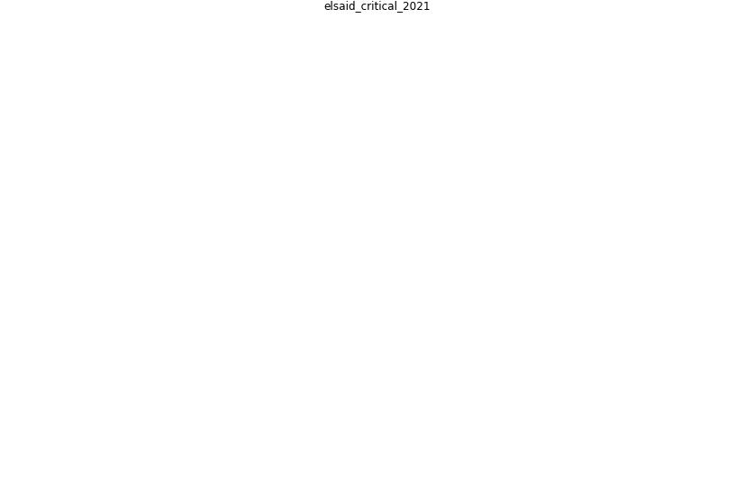

# Article: A critical review of heating, ventilation, and air conditioning (HVAC) systems within the context of a global SARS-CoV-2 epidemic (elsaid_critical_2021)

* Source: [10.1016/j.psep.2021.09.021](https://doi.org/10.1016/j.psep.2021.09.021)
* Year: 2021
* Cluster: [air-uv](cluster_2)

## Keywords

 * [a c](keyword_a_c), active air purifier, [aerosol](keyword_aerosol), [air](keyword_air), [air conditioning](keyword_air_conditioning), [air filter](keyword_air_filter), air filtration, [air pollution](keyword_air_pollution), air purification, air quality, airborne transmission, airflow, anesth, [ashrae](keyword_ashrae), be be, [build](keyword_build), ceiling fan, [china](keyword_china), comunian, [coronavirus](keyword_coronavirus), covid 19 epidemic, [covid 19 pandemic](keyword_covid_19_pandemic), covid 19pandemic, [covid-19](keyword_covid-19), cross ventilation, [disease](keyword_disease), [disinfection](keyword_disinfection), [droplet](keyword_droplet), emerg, [epidemic](keyword_epidemic), fan, [filter](keyword_filter), front, g b abdelaziz, global pandemic, guangzhou, h a elsaid, h a mohame, heating ventilation and air conditioning, hepa, hepa filter, [hospital](keyword_hospital), [humidity](keyword_humidity), [hvac](keyword_hvac), hvac system, [indoor](keyword_indoor), indoor air, [indoor air quality](keyword_indoor_air_quality), [indoor environment](keyword_indoor_environment), [infect](keyword_infect), [infection](keyword_infection), infectious, lidia, liu, [lockdown](keyword_lockdown), luca borro, [manhattan](keyword_manhattan), [mask](keyword_mask), mechanical ventilation, merv 13, morawskaa, natural ventilation, neurotransmitter, [new jersey](keyword_new_jersey), [new york city](keyword_new_york_city), outdoor air, [pandemic](keyword_pandemic), paramutational, [particle](keyword_particle), [pollutant](keyword_pollutant), rehva, relative humidity, respir, respiratory infection, [sar cov 2](keyword_sar_cov_2), sarscov 2, severe acute respiratory syndrome coronavirus 2, [singapore](keyword_singapore), [spread](keyword_spread), summer, sustain, [system](keyword_system), [temperature](keyword_temperature), [toilet](keyword_toilet), [transmission](keyword_transmission), [trenton](keyword_trenton), [unesco](keyword_unesco), [uvgi](keyword_uvgi), vasc, [ventilation](keyword_ventilation), ventilation rate, [ventilation system](keyword_ventilation_system), [virus](keyword_virus), [window](keyword_window), [winter](keyword_winter), [world heritage site](keyword_world_heritage_site), [wuhan](keyword_wuhan), xu, yes unabashedly, yu

## Concepts

 

## Neighbours

### Closest articles

* Review and comparison of HVAC operation guidelines in different countries during the COVID-19 pandemic - [LINK](article_guo_review_2021)
* Heating, ventilation and air-conditioning systems in the context of COVID-19 - [LINK](article_ecdc_heating_2020)
* Ventilation use in nonmedical settings during COVID-19: Cleaning protocol, maintenance, and recommendations - [LINK](article_nembhard_ventilation_2020)
* A review of facilities management interventions to mitigate respiratory infections in existing buildings - [LINK](article_zhang_review_2022)
* ASHRAE Position Document on Infectious Aerosols - [LINK](article_ashrae_ashrae_2022)
* How can airborne transmission of COVID-19 indoors be minimised? - [LINK](article_morawska_how_2020)
* The efficacy of social distance and ventilation effectiveness in preventing COVID-19 transmission - [LINK](article_sun_efficacy_2020)
* The ventilation of buildings and other mitigating measures for COVID-19: a focus on wintertime - [LINK](article_burridge_ventilation_2021)
* Indoor Air Quality: Rethinking rules of building design strategies in post-pandemic architecture - [LINK](article_megahed_indoor_2021)

### Closest BPs

* Indoor Environmental Quality (IEQ) monitoring system - [LINK](bp_3)
* Installing UV in ductwork - [LINK](bp_10)
* Installing high-efficiency air filters - [LINK](bp_11)
