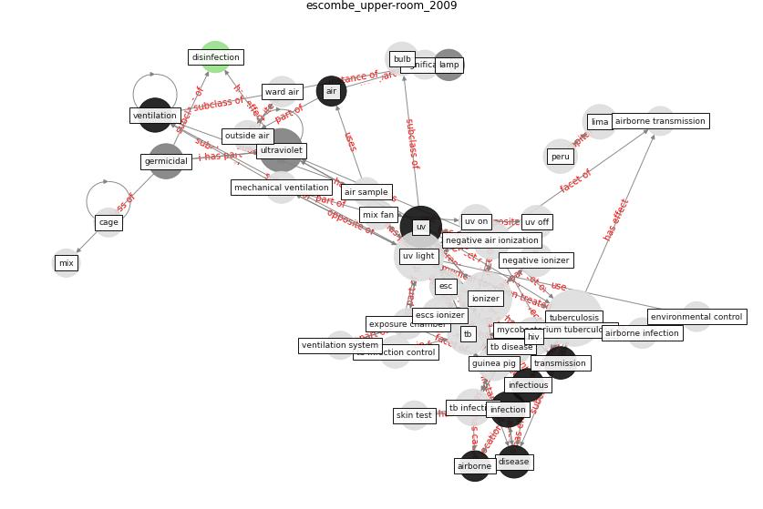

# Article: Upper-Room Ultraviolet Light and Negative Air Ionization to Prevent Tuberculosis Transmission (escombe_upper-room_2009)

* Source: [10.1371/journal.pmed.1000043](https://doi.org/10.1371/journal.pmed.1000043)
* Year: 2009
* Cluster: [air-uv](cluster_2)

## Keywords

 * adverse uv effect, [aerosol](keyword_aerosol), [air](keyword_air), air condition, air sample, [airborne](keyword_airborne), [airborne infection](keyword_airborne_infection), airborne infection model, airborne transmission, [antibiotic](keyword_antibiotic), bactericidal, bulb, cage, clear the air, clinical setting, [control](keyword_control), control group, day, [disease](keyword_disease), [disinfection](keyword_disinfection), drug resistant tuberculosis, effect, electrostatic space charge system, emergency department, enclosure, [engineering](keyword_engineering), environmental control, esc, escs ionizer, evans vaccine, [exposure](keyword_exposure), exposure chamber, fan, [germicidal](keyword_germicidal), gilman rh, guinea pig, [hiv](keyword_hiv), [hospital](keyword_hospital), hospital nacional dos de mayo, [infection](keyword_infection), [infection control](keyword_infection_control), infectious, [ionizer](keyword_ionizer), ionizer enclosure, kalkut ge, lamp, lima, logarithmic scale, lumalier, mechanical ventilation, median exposure, mill cc, mix, mix fan, mycobacterium, mycobacterium tuberculosis, nardell ea, negative air ionization, negative ionizer, nosocomial transmission, outside air, ozone, [pathogen](keyword_pathogen), peccia j, [peru](keyword_peru), plos medicine, plosmedicine, poolman em, ppd positive, pulmonary tb, relative humidity, salmonella, significant, skin test, symptom of tuberculosis, [tb](keyword_tb), tb disease, tb infection, tb infection control, tb transmission, [transmission](keyword_transmission), tuberculin skin test, [tuberculosis](keyword_tuberculosis), two sample proportion test, [ultraviolet](keyword_ultraviolet), [uv](keyword_uv), uv bulb, uv group, [uv light](keyword_uv_light), uv off, uv off day, uv on, uv on day, uv field, uv fixture, ventilate, [ventilation](keyword_ventilation), [ventilation system](keyword_ventilation_system), ward air, ward air exposure chamber

## Concepts

 

## Neighbours

### Closest articles

* Applications of ultraviolet germicidal irradiation disinfection in health care facilities: Effective adjunct, but not stand-alone technology - [LINK](article_memarzadeh_applications_2010)
* Behind the Update: ASHRAE Handbook Chapters on UV-C to Include Updated Best Practices, Guidance - [LINK](article_ashrae_behind_2020)
* Air Disinfection for Airborne Infection Control with a Focus on COVID‐19: Why Germicidal UV is Essential             † - [LINK](article_nardell_air_2021)
* Upper-room ultraviolet air disinfection might help to reduce COVID-19 transmission in buildings: a feasibility study - [LINK](article_beggs_upper-room_2020)
* Case Study: Using Germicidal UV-C to Mitigate COVID-19 - HVAC - [LINK](article_healthcare_facilities_today_case_2021)
* Effect of Ultraviolet Germicidal Irradiation on Viral Aerosols - [LINK](article_walker_effect_2007)
* Far-UVC light (222 nm) efficiently and safely inactivates airborne human coronaviruses - [LINK](article_buonanno_far-uvc_2020)
* Efficacy of an Automated Multiple Emitter Whole-Room Ultraviolet-C Disinfection System Against Coronaviruses MHV and MERS-CoV - [LINK](article_bedell_efficacy_2016)
* Methods for air cleaning and protection of building occupants from airborne pathogens - [LINK](article_bolashikov_methods_2009)

### Closest BPs

* Installing UV in ductwork - [LINK](bp_10)
* Installing high-efficiency air filters - [LINK](bp_11)
* Negative pressure rooms - [LINK](bp_13)
