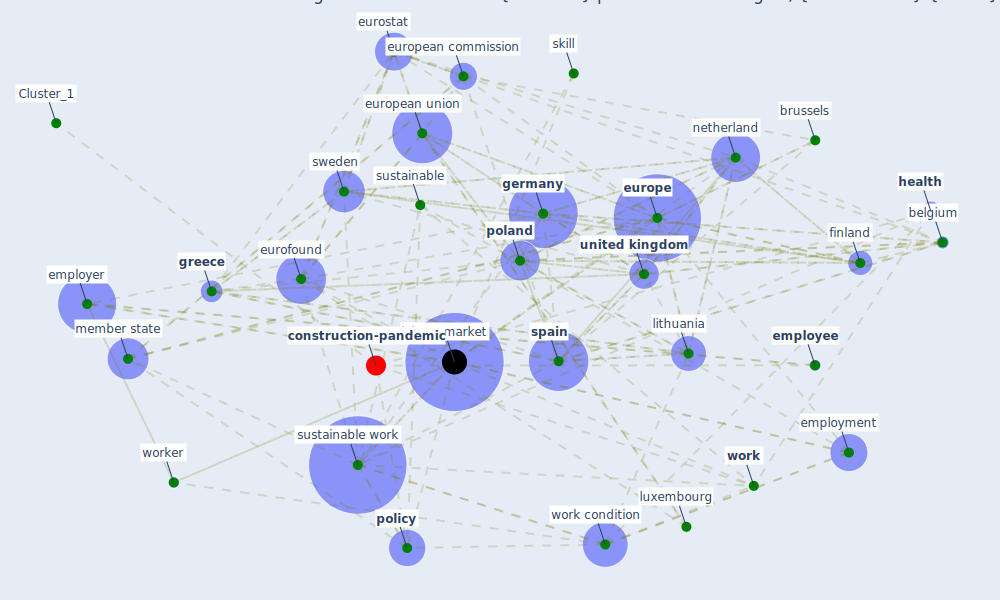

# Article: Sustainable work throughout the life course: National policies and strategies, Publications Office of the European Union (eurofund_sustainable_2016)

* [https://www.eurofound.europa.eu/sites/default/files/ef_publication/field_ef_document/ef1610en_4.pdf](https://www.eurofound.europa.eu/sites/default/files/ef_publication/field_ef_document/ef1610en_4.pdf)
* Year: 2016
* Cluster: [construction-pandemic](cluster_1)

## Keywords

 * apprenticeship, belgium, brussels, care leave, care responsibility, childcare, collective agreement, collective bargaining, [company](keyword_company), competence, [country](keyword_country), disability, disable, dublin, dutch, [education](keyword_education), employability, [employee](keyword_employee), [employer](keyword_employer), employment, [eurofound](keyword_eurofound), [europe](keyword_europe), european, european commission, european country, [european union](keyword_european_union), eurostat, family, father, [finland](keyword_finland), german, [germany](keyword_germany), [government](keyword_government), [greece](keyword_greece), [health](keyword_health), [health and safety](keyword_health_and_safety), in work poverty, income support, [industry](keyword_industry), job, job quality, [labour market](keyword_labour_market), learn, legislation, life course, life course transition, life stage, lifelong learning, lithuania, luxembourg, [member state](keyword_member_state), n a, [netherland](keyword_netherland), [oecd](keyword_oecd), part time, part time work, [poland](keyword_poland), [policy](keyword_policy), policy framework, policymaker, precarious, public employment service, public policy, public sector, quality of work, regulation, retirement, self employ, skill, skill development, [society](keyword_society), [spain](keyword_spain), subsidy, [sustainability](keyword_sustainability), sustainability of work, sustainable, [sustainable work](keyword_sustainable_work), sustainable work policy, sustainable work throughout the life course, [sweden](keyword_sweden), swedish, the uk, trade union, [training](keyword_training), transition, unemployed, unemployment, unemployment benefit, [united kingdom](keyword_united_kingdom), [well be](keyword_well_be), woman, [work](keyword_work), work condition, work environment, work life, work life balance, work time, [worker](keyword_worker), [workplace](keyword_workplace), young people

## Concepts

 

## Neighbours

### Closest articles

* Mapping research in logistics and supply chain management during COVID-19 pandemic - [LINK](article_montoya-torres_mapping_2021)
* The socio-economic implications of the coronavirus pandemic (COVID-19): A review - [LINK](article_nicola_socio-economic_2020)
* The COVID-19 pandemic: Lessons on building more equal and sustainable societies - [LINK](article_van_barneveld_covid-19_2020)
* Amplifying the role of knowledge translation platforms in the COVID-19 pandemic response - [LINK](article_el-jardali_amplifying_2020)
* Health, Economic and Social Development Challenges of the COVID-19 Pandemic: Strategies for Multiple and Interconnected Issues - [LINK](article_panneer_health_2022)
* Global value chains: Efficiency and risks in the context of COVID-19 - [LINK](article_oecd_global_2021)
* 10 tech trends getting us through the COVID-19 pandemic - [LINK](article_yan_10_2020)
* COVID-19 and the UN Sustainable Development Goals: Threat to Solidarity or an Opportunity? - [LINK](article_leal_filho_covid-19_2020)
* From Viral City to Smart City: Learning from Pandemic Experiences - [LINK](article_sakellarides_viral_2020)
* The City Under COVID‐19: Podcasting As Digital Methodology - [LINK](article_rogers_city_2020)

### Closest BPs

* Blueprint: Smart Locker System - [LINK](bp_1)
* Blueprint: Resilience in staffing and skills training - [LINK](bp_12)
* Blueprint: Tracking and enforcing use of Personal Protective Equipment - [LINK](bp_23)
