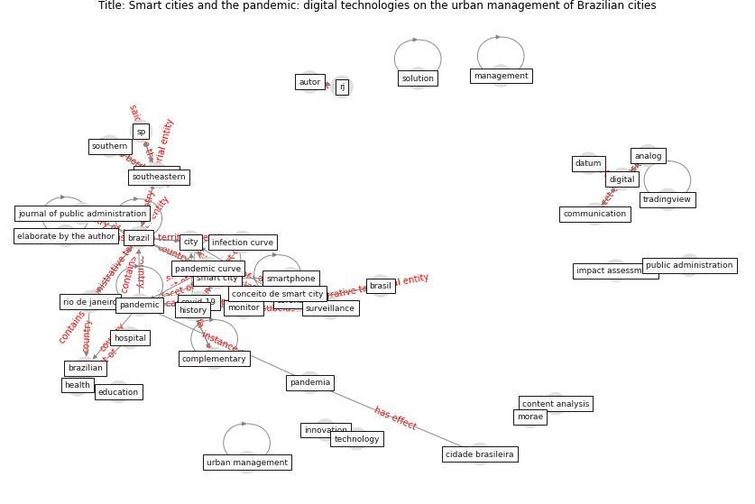

# Article: Smart cities and the pandemic: digital technologies on the urban management of Brazilian cities (fariniuk_smart_2020)

* Source: [10.1590/0034-761220200272x](https://doi.org/10.1590/0034-761220200272x)
* Year: 2020
* Cluster: [city-urban](cluster_7)

## Keywords

 * administração pública, analog, [big datum](keyword_big_datum), brasil, brasília, [brazil](keyword_brazil), brazilian journal of public administration, ciberespaço, cidade, [city](keyword_city), collective intelligence, consolidation, coronavírus, [covid-19](keyword_covid-19), curitiba, cyber security, [datum](keyword_datum), demand, [digital](keyword_digital), digital tool, digital tooling, dilemas da recentralização, distritofederal, [education](keyword_education), educational, egregiously, elaborate, elaborate by the author, embody, emergency response, [epidemiology](keyword_epidemiology), estudio nacional de ciencia, figueiredo, filho, fragmentation, gdp, gdp distribution, gdp per capita, [governance](keyword_governance), [health](keyword_health), history, ibge, initiative, [innovation](keyword_innovation), instituto brasileiro de geografia e estatística, integration, le città invisibili, legend, letouzé, llacuna m, los resultado, malasya, metropolis, ministry of health, ministério da saúde, municipal service, municipality, [new jersey](keyword_new_jersey), nj, northeastern, northern, pandemia, [pandemic](keyword_pandemic), pandemic curve, pandemic situation, paraná, pedagogical, penang, platform, pontifícia universidade católica do paraná, pr, pr brazil, [protocol](keyword_protocol), [public administration](keyword_public_administration), public management, quantitative, rap, [rio de janeiro](keyword_rio_de_janeiro), rj, rolnik, [smart city](keyword_smart_city), smart city and the pandemic, smart utopia, smartphone, solution, somekh, southern, sp, spreadsheet, sterly, [surveillance](keyword_surveillance), são paulo, [technology](keyword_technology), telephone exchange, the author, tradingview, [united kingdom](keyword_united_kingdom), university of oxford, urban management, ἀtechnology

## Concepts

 

## Neighbours

### Closest articles

* Learning from the COVID-19 pandemic in governing smart cities - [LINK](article_bolivar_learning_2022)
* Smart cities and a data-driven response to COVID-19 - [LINK](article_james_smart_2020)
* The three modes of existence of the pandemic smart city - [LINK](article_soderstrom_three_2021)
* The Smart City and Covid‐19 - [LINK](article_webb_smart_2020)
* Future (post-COVID) digital, smart and sustainable cities in the wake of 6G: Digital twins, immersive realities and new urban economies - [LINK](article_allam_future_2021)
* On the Coronavirus (COVID-19) Outbreak and the Smart City Network: Universal Data Sharing Standards Coupled with Artificial Intelligence (AI) to Benefit Urban Health Monitoring and Management - [LINK](article_allam_coronavirus_2020)
* The Emergence of Anti-Privacy and Control at the Nexus between the Concepts of Safe City and Smart City - [LINK](article_allam_emergence_2019)
* Contributions of Smart City Solutions and Technologies to Resilience against the COVID-19 Pandemic: A Literature Review - [LINK](article_sharifi_contributions_2021)
* Pandemic stricken cities on lockdown. Where are our planning and design professionals [now, then and into the future]? - [LINK](article_allam_pandemic_2020)
* The COVID-19 pandemic: Impacts on cities and major lessons for urban planning, design, and management - [LINK](article_sharifi_covid-19_2020)

### Closest BPs

* Building Adaptation during a pandemic - [LINK](bp_14)
* Tender support at building stage - [LINK](bp_9)
* Architecture design - [LINK](bp_2)
