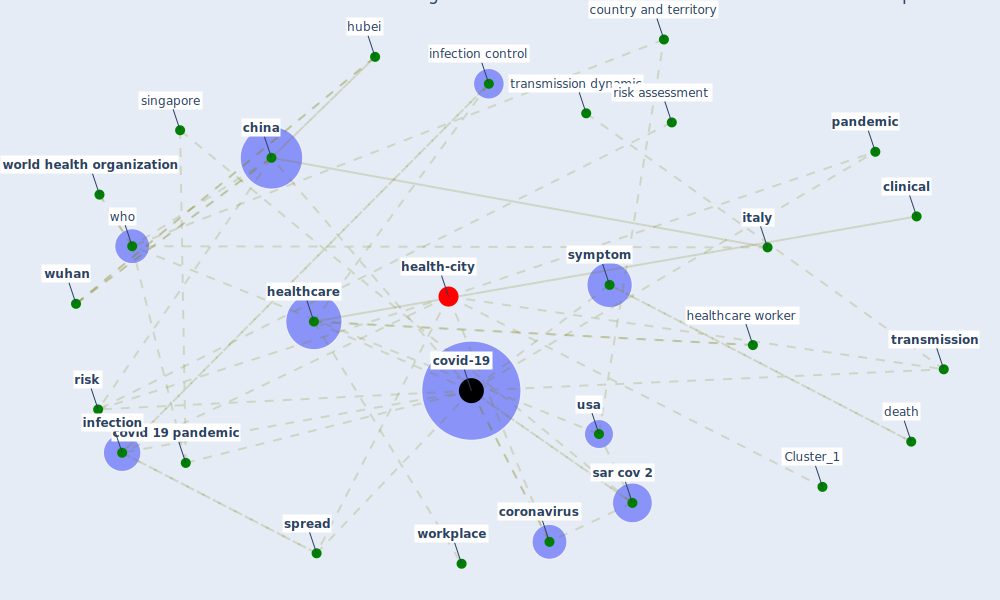

# Article: COVID-19: Risk assessment and mitigation measures in healthcare and non-healthcare workplaces (fawzy_covid-19_2021)

* Source: [10.51585/gjm.2021.2.0007](https://doi.org/10.51585/gjm.2021.2.0007)
* Year: 2021
* Cluster: [health-city](cluster_1)

## Keywords

 * administrative control, animal, behavioral, check hand, [china](keyword_china), [clinical](keyword_clinical), control measure, [coronavirus](keyword_coronavirus), cough, country and territory, covid 19 infection, covid 19 outbreak, [covid 19 pandemic](keyword_covid_19_pandemic), [covid-19](keyword_covid-19), [customer](keyword_customer), death, develop, [door](keyword_door), effect analysis, electre tri, elevator, [employee](keyword_employee), [employer](keyword_employer), engineering control, [epidemic](keyword_epidemic), european parliament, eye, fanidi, fax, [filter](keyword_filter), finger, hazard, [health](keyword_health), [health care](keyword_health_care), health worker, [healthcare](keyword_healthcare), healthcare facility, healthcare provider, healthcare worker, [hospital](keyword_hospital), [hubei](keyword_hubei), [human](keyword_human), hygienic, [icu](keyword_icu), [infection](keyword_infection), [infection control](keyword_infection_control), intensive care unit, isolate themselves, isolation, [italy](keyword_italy), jouven x, laboratory bioriskmanagement, laboratory personnel, long term care, [low](keyword_low), male, middle income country, mitigation measure, mouth, no contact with people know to be, non healthcare, [outbreak](keyword_outbreak), [pandemic](keyword_pandemic), poor country, preventive measure, protect workerhealth, [psychological](keyword_psychological), [public health](keyword_public_health), public transportation, [risk](keyword_risk), risk analysis, risk assessment, risk priority number, risk rankingtool, [sar cov 2](keyword_sar_cov_2), sar cov 2 virus infection, sarscov 2 infection in farm mink, sarscov 2 virus infection, singapore, singlehandedly, sneeze, sneeze guard, [spread](keyword_spread), [symptom](keyword_symptom), [telework](keyword_telework), territory, thailand, thepublic, toe, [transmission](keyword_transmission), transmission chain, transmission dynamic, [usa](keyword_usa), [vaccine](keyword_vaccine), who, [workplace](keyword_workplace), [world health organization](keyword_world_health_organization), worldhealth organization, [wuhan](keyword_wuhan), wuhan city

## Concepts

 

## Neighbours

### Closest articles

* COVID-19 Prevention and Control Measures in Workplace Settings: A Rapid Review and Meta-Analysis - [LINK](article_ingram_covid-19_2021)
* Physical interventions to interrupt or reduce the spread of respiratory viruses: systematic review - [LINK](article_jefferson_physical_2008)
* COVID-19 Pandemic: Prevention and Protection Measures to Be Adopted at the Workplace - [LINK](article_cirrincione_covid-19_2020)
* COVID-19 and its Modes of Transmission - [LINK](article_karia_covid-19_2020)
* Current knowledge of COVID-19: Advances, challenges and future perspectives - [LINK](article_wu_current_2021)
* Contributions to the mitigation of the COVID-19 pandemic - [LINK](article_pilz_contributions_2022)
* Sustainability of Coronavirus on Different Surfaces - [LINK](article_suman_sustainability_2020)
* SARS-CoV-2 in wastewater: potential health risk, but also data source - [LINK](article_lodder_sars-cov-2_2020)
* Persistence of coronaviruses on inanimate surfaces and their inactivation with biocidal agents - [LINK](article_kampf_persistence_2020)
* Pandemic Analytics: How Countries are Leveraging Big Data Analytics and Artificial Intelligence to Fight COVID-19? - [LINK](article_mehta_pandemic_2021)

### Closest BPs

* Blueprint: Resilience in staffing and skills training - [LINK](bp_12)
* Blueprint: Negative pressure rooms - [LINK](bp_13)
* Blueprint: Smart Locker System - [LINK](bp_1)
