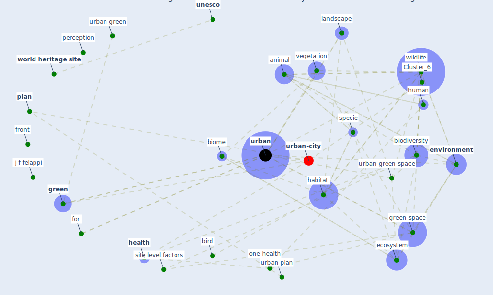

# Article: Green infrastructure through the lens of “One Health”: A systematic review and integrative framework uncovering synergies and trade-offs between mental health and wildlife support in cities (felappi_green_2020)

* Source: [10.1016/j.scitotenv.2020.141589](https://doi.org/10.1016/j.scitotenv.2020.141589)
* Year: 2020
* Cluster: [space-housing](cluster_4)

## Keywords

 * accessibility, acoustic environment, aesthetic, animal, [australia](keyword_australia), bee, benefits, [biodiversity](keyword_biodiversity), biogeogr, biol, biome, bird, bonn, butterflies, [china](keyword_china), [city](keyword_city), cityˈsicker, connectivity, conserv, conservation, curr, [design](keyword_design), [disease](keyword_disease), ecosyst, [ecosystem](keyword_ecosystem), [environment](keyword_environment), [europe](keyword_europe), for, for urban, front, [germany](keyword_germany), [green](keyword_green), green infrastructure, [green space](keyword_green_space), habitat, heal, healing, [health](keyword_health), [human](keyword_human), [human health](keyword_human_health), i g h t s, [indicator](keyword_indicator), israel, j f felappi, j felappi, korpela, landscape, [management](keyword_management), [manhattan](keyword_manhattan), mediterranean, multifunctionality, nat, [nature](keyword_nature), [new jersey](keyword_new_jersey), [new south wale](keyword_new_south_wale), new urban agenda, [new york city](keyword_new_york_city), [north america](keyword_north_america), north rhine westphalia, one health, park, perception, peri urban, [perspective](keyword_perspective), [plan](keyword_plan), [plant](keyword_plant), [psychological](keyword_psychological), [research](keyword_research), restoration, rural, site level factors, specie, [study](keyword_study), systematic review, taxonomic groups of animals, tel aviv, [trenton](keyword_trenton), [unesco](keyword_unesco), [united nations](keyword_united_nations), university of bonn, [urban](keyword_urban), urban area, urban ecosyst, urban environment, urban green, [urban green space](keyword_urban_green_space), urban matrix, urban park, [urban plan](keyword_urban_plan), [urban planning](keyword_urban_planning), urban wildlife, vegetation, vegetation structure, [well be](keyword_well_be), wildl, [wildlife](keyword_wildlife), wildlife support, [world health organization](keyword_world_health_organization), [world heritage site](keyword_world_heritage_site), ḅ ει

## Concepts

 

## Neighbours

### Closest articles

* Urban Green Infrastructure and Green Open Spaces: An Issue of Social Fairness in Times of COVID-19 Crisis - [LINK](article_reinwald_urban_2021)
* The impact of the COVID-19 pandemic on the importance of urban green spaces to the public - [LINK](article_noszczyk_impact_2022)
* Urban form: Realising the value of green space: a planners’ perspective on the COVID-19 pandemic - [LINK](article_ahmadpoor_urban_2021)
* The role of green roofs in post COVID-19 confinement: An analysis of willingness to pay - [LINK](article_manso_role_2021)
* Effects of the COVID-19 pandemic on the use and perceptions of urban green space: An international exploratory study - [LINK](article_ugolini_effects_2020)
* Green in times of COVID-19: urban green space relevance during the COVID-19 pandemic in Buenos Aires City - [LINK](article_marconi_green_2022)
* Association between indoor-outdoor green features and psychological health during the COVID-19 lockdown in Italy: A cross-sectional nationwide study - [LINK](article_spano_association_2021)
* The Impact of COVID-19 on Public Space: A Review of the Emerging Questions - [LINK](article_honey-roses_impact_2020)
* Green spaces, especially forest, linked to lower SARS-CoV-2 infection rates: A one-year nationwide study - [LINK](article_jiang_green_2021)
* Impact of Covid-19 on the built environment - [LINK](article_mahima_impact_2022)

### Closest BPs

* Blueprint: Monitoring of wastewater - [LINK](bp_21)
* Blueprint: Resilience in staffing and skills training - [LINK](bp_12)
* Blueprint: Air Cleaning Plants - [LINK](bp_15)
