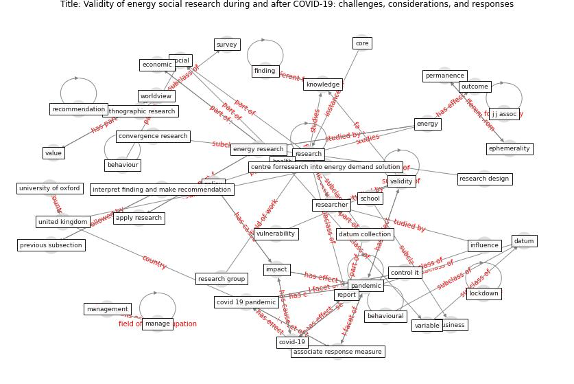

# Article: Validity of energy social research during and after COVID-19: challenges, considerations, and responses (fell_validity_2020)

* Source: [10.1016/j.erss.2020.101646](https://doi.org/10.1016/j.erss.2020.101646)
* Year: 2020
* Cluster: [construction-resilience](cluster_5)

## Keywords

 * aftermath, apply research, associate response measure, association, behaviour, [behavioural](keyword_behavioural), bias, [business](keyword_business), centre forresearch into energy demand solution, checklist, commun, confound, [control](keyword_control), control it, convergence, convergence research, core, [covid 19 pandemic](keyword_covid_19_pandemic), [covid-19](keyword_covid-19), [crisis](keyword_crisis), [datum](keyword_datum), datum collection, demographic variable, [economic](keyword_economic), [energy](keyword_energy), energy research, energy researcher, energy study, energy use, ephemerality, [epidemic](keyword_epidemic), [epidemiological](keyword_epidemiological), ethical, ethnographic research, experiment, govt, [health](keyword_health), human life, [impact](keyword_impact), income, inequality, interpret finding and make recommendation, influence, italian, j j assoc, [knowledge](keyword_knowledge), [lockdown](keyword_lockdown), low carbon, low hang fruit, m pareek, manage, management, n pan, national, normative, opportunity, outcome, [pandemic](keyword_pandemic), permanence, pharm, [policy](keyword_policy), polit, post-pandemic, pre-pandemic, previous subsection, randomize control, recommendation, report, [research](keyword_research), research design, research group, research question, [researcher](keyword_researcher), response, sareen, [school](keyword_school), short term impact, significant, [social](keyword_social), spanish, spurious correlation, stop at home, [study](keyword_study), study design, survey, transfer payment, [travel](keyword_travel), uk research and innovation, uncertainty, unemployment, [united kingdom](keyword_united_kingdom), university of oxford, validity, validity challenge, value, variable, volunteer, [vulnerability](keyword_vulnerability), worldview, finding

## Concepts

 

## Neighbours

### Closest articles

* Contextualizing the Covid-19 pandemic for a carbon-constrained world: Insights for sustainability transitions, energy justice, and research methodology - [LINK](article_sovacool_contextualizing_2020)
* Covid-19 and the politics of sustainable energy transitions - [LINK](article_kuzemko_covid-19_2020)
* The role of green roofs in post COVID-19 confinement: An analysis of willingness to pay - [LINK](article_manso_role_2021)
* The impact of the COVID-19 pandemic on the importance of urban green spaces to the public - [LINK](article_noszczyk_impact_2022)
* Effects of the COVID-19 pandemic on the use and perceptions of urban green space: An international exploratory study - [LINK](article_ugolini_effects_2020)
* Green in times of COVID-19: urban green space relevance during the COVID-19 pandemic in Buenos Aires City - [LINK](article_marconi_green_2022)
* Urban form: Realising the value of green space: a planners’ perspective on the COVID-19 pandemic - [LINK](article_ahmadpoor_urban_2021)
* Urban Green Infrastructure and Green Open Spaces: An Issue of Social Fairness in Times of COVID-19 Crisis - [LINK](article_reinwald_urban_2021)
* Should I Stay or Should I Go? Tourists’ COVID-19 Risk Perception and Vacation Behavior Shift - [LINK](article_bratic_should_2021)
* Seeing the invisible hand: Underlying effects of COVID-19 on tourists’ behavioral patterns - [LINK](article_li_seeing_2020)

### Closest BPs

* Blueprint: Mental health – Act: Do something - [LINK](bp_18)
* Blueprint: Mental health – Commit: Do something meaningfull - [LINK](bp_20)
* Blueprint: Mental health – Belong: Do something with someone - [LINK](bp_19)
