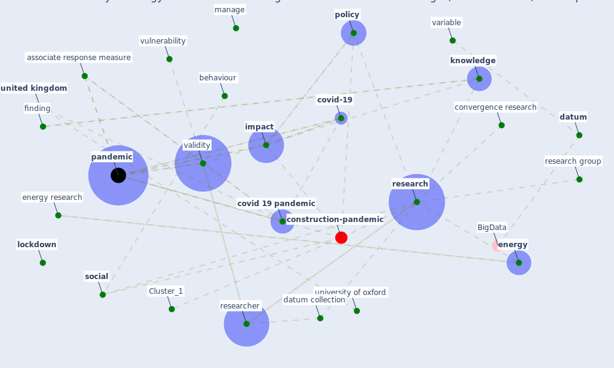

# Article: Validity of energy social research during and after COVID-19: challenges, considerations, and responses (fell_validity_2020)

* Source: [10.1016/j.erss.2020.101646](https://doi.org/10.1016/j.erss.2020.101646)
* Year: 2020
* Cluster: [construction-pandemic](cluster_1)

## Keywords

 * aftermath, apply research, associate response measure, association, behaviour, behavioural, bias, [business](keyword_business), centre forresearch into energy demand solution, checklist, commun, confound, [control](keyword_control), control it, convergence, convergence research, core, [covid 19 pandemic](keyword_covid_19_pandemic), [covid-19](keyword_covid-19), [crisis](keyword_crisis), [datum](keyword_datum), datum collection, demographic variable, [economic](keyword_economic), [energy](keyword_energy), energy research, energy researcher, energy study, energy use, ephemerality, [epidemic](keyword_epidemic), [epidemiological](keyword_epidemiological), ethical, ethnographic research, experiment, govt, [health](keyword_health), human life, [impact](keyword_impact), income, inequality, interpret finding and make recommendation, influence, italian, j j assoc, [knowledge](keyword_knowledge), [lockdown](keyword_lockdown), low carbon, low hang fruit, m pareek, manage, [management](keyword_management), n pan, national, normative, opportunity, outcome, [pandemic](keyword_pandemic), permanence, pharm, [policy](keyword_policy), polit, post-pandemic, pre-pandemic, previous subsection, randomize control, recommendation, report, [research](keyword_research), research design, research group, research question, [researcher](keyword_researcher), response, sareen, [school](keyword_school), short term impact, significant, [social](keyword_social), spanish, spurious correlation, stop at home, [study](keyword_study), study design, [survey](keyword_survey), transfer payment, [travel](keyword_travel), uk research and innovation, uncertainty, unemployment, [united kingdom](keyword_united_kingdom), university of oxford, validity, validity challenge, value, variable, volunteer, [vulnerability](keyword_vulnerability), worldview, finding

## Concepts

 

## Neighbours

### Closest articles

* Contextualizing the Covid-19 pandemic for a carbon-constrained world: Insights for sustainability transitions, energy justice, and research methodology - [LINK](article_sovacool_contextualizing_2020)
* Covid-19 and the politics of sustainable energy transitions - [LINK](article_kuzemko_covid-19_2020)
* Addressing the impact of COVID-19 lockdown on energy use in municipal buildings: A case study in Florianópolis, Brazil - [LINK](article_geraldi_addressing_2021)
* Impacts of COVID-19 on residential building energy use and performance - [LINK](article_kawka_impacts_2021)
* Occupants’ behavior and activity patterns influencing the energy consumption in the Kuwaiti residences - [LINK](article_al-mumin_occupants_2003)
* Reflecting on Impacts of COVID19 on Sustainable Buildings and Cities - [LINK](article_gonzalez_reflecting_2021)
* The effect of occupant distribution on energy consumption and COVID-19 infection in buildings: A case study of university building - [LINK](article_mokhtari_effect_2021)
* Assessment of Building Automation and Control Systems in Danish Healthcare Facilities in the COVID-19 Era - [LINK](article_pedersen_assessment_2022)
* Ten questions concerning occupant health in buildings during normal operations and extreme events including the COVID-19 pandemic - [LINK](article_awada_ten_2021)
* Occupant health in buildings: Impact of the COVID-19 pandemic on the opinions of building professionals and implications on research - [LINK](article_awada_occupant_2022)

### Closest BPs

* Blueprint: nan - [LINK](bp_34)
* Blueprint: Tender support at building stage - [LINK](bp_9)
* Blueprint: Building Adaptation during a pandemic - [LINK](bp_14)
