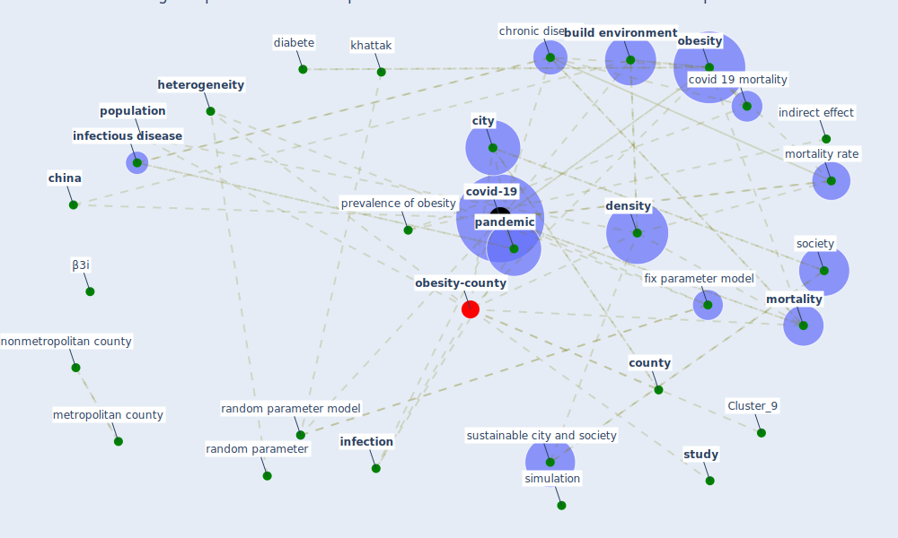

# Article: Treating two pandemics for the price of one: Chronic and infectious disease impacts of the built and natural environment (frank_treating_2021)

* Source: [10.1016/j.scs.2021.103089](https://doi.org/10.1016/j.scs.2021.103089)
* Year: 2021
* Cluster: [obesity-county](cluster_9)

## Keywords

 * 65 year plus, accident research, [air pollution](keyword_air_pollution), american community survey, attitudinal, auto centrality index, behavior, black, [brazil](keyword_brazil), [build environment](keyword_build_environment), [china](keyword_china), [chronic](keyword_chronic), [chronic disease](keyword_chronic_disease), [city](keyword_city), [community](keyword_community), [county](keyword_county), covid 19 fatality rate, covid 19 mortality, [covid 19 pandemic](keyword_covid_19_pandemic), [covid-19](keyword_covid-19), [demographic](keyword_demographic), [density](keyword_density), [design](keyword_design), [diabete](keyword_diabete), direct, [disease](keyword_disease), ecological, [epidemiology](keyword_epidemiology), ewe, explanatory variable, [fatality](keyword_fatality), fatality rate, fix parameter model, [frank](keyword_frank), [health](keyword_health), health outcome, heart disease, [heterogeneity](keyword_heterogeneity), highly contagious infectious disease, [indirect effect](keyword_indirect_effect), [infection](keyword_infection), infection rate, [infectious](keyword_infectious), [infectious disease](keyword_infectious_disease), iroz elardo, khattak, low income, mervosh, [meta analysis](keyword_meta_analysis), meth, method in accident research, metropolitan county, [model](keyword_model), morbidity, [mortality](keyword_mortality), mortality rate, moudon, [neighborhood](keyword_neighborhood), nonmetropolitan county, normally distribute, [obesity](keyword_obesity), odological, [pandemic](keyword_pandemic), [parameter](keyword_parameter), pedestrian orient link, [plan](keyword_plan), [population](keyword_population), population density, prevalence of obesity, [public health](keyword_public_health), random parameter, random parameter model, [region](keyword_region), [research](keyword_research), [residential](keyword_residential), robert, sabouri, saelen, [salli](keyword_salli), sample size, [simulation](keyword_simulation), smart location database, [society](keyword_society), sociodemographic, [spread](keyword_spread), standard deviation, street connectivity, [study](keyword_study), sustainable city, sustainable city and society, systematic review, tavernise, tree canopy, [united states](keyword_united_states), urban design, [variable](keyword_variable), walk, [walkability](keyword_walkability), white, [β3i](keyword_β3i)

## Concepts

 

## Neighbours

### Closest articles

* The socio-economic determinants of COVID-19: A spatial analysis of German county level data - [LINK](article_ehlert_socio-economic_2021)
* Association of built environment attributes with the spread of COVID-19 at its initial stage in China - [LINK](article_li_association_2021)
* The Socio-Spatial Determinants of COVID-19 Diffusion: The Impact of Globalisation, Settlement Characteristics and Population - [LINK](article_sigler_socio-spatial_2020)
* Urban design attributes and resilience: COVID-19 evidence from New York City - [LINK](article_yang_urban_2021)
* COVID-19 and social inequalities: a complex and dynamic interaction - [LINK](article_quantin_covid-19_2022)
* Understanding the role of urban design in disease spreading - [LINK](article_brizuela_understanding_2019)
* Mental health economics: A prospective study on psychological flourishing and associations with healthcare costs and sickness benefit transfers in Denmark - [LINK](article_santini_mental_2021)
* COVID-19 and the rise of intimate partner violence - [LINK](article_aguero_covid-19_2021)
* The impact of COVID-19 and strategies for mitigation and suppression in low- and middle-income countries - [LINK](article_walker_impact_2020)

### Closest BPs

* Blueprint: Resilience in staffing and skills training - [LINK](bp_12)
* Blueprint: Installing high-efficiency air filters - [LINK](bp_11)
* Blueprint: Air Cleaning Plants - [LINK](bp_15)
