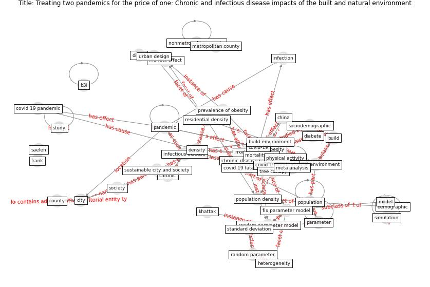

# Article: __Treating two pandemics for the price of one: Chronic and infectious disease impacts of the built and natural environment__ (frank_treating_2021)

* [10.1016/j.scs.2021.103089](https://doi.org/10.1016/j.scs.2021.103089)
* Cluster: [space-urban](cluster_13)

## Keywords

* [obesity](keyword_obesity), [covid-19](keyword_covid-19), [chronic disease](keyword_chronic_disease), [mortality](keyword_mortality), [build environment](keyword_build_environment), [b3i](keyword_b3i), [physical activity](keyword_physical_activity), [society](keyword_society), [random parameter model](keyword_random_parameter_model), [natural environment](keyword_natural_environment), density, county, [infectious disease](keyword_infectious_disease), heterogeneity, [population](keyword_population)

## Keywords at large

* [biophilic design](keyword_biophilic_design), [architecture](keyword_architecture), [sustainable architecture](keyword_sustainable_architecture), [nature](keyword_nature), [design](keyword_design), [biophilic](keyword_biophilic), [environ](keyword_environ), [biophilia](keyword_biophilia), [wellbeing](keyword_wellbeing), [health](keyword_health)

## Concepts

 

### References 

* [Association of built environment attributes with the
spread of COVID-19 at its initial stage in China](article_li_association_2021)
* [Antivirus-built environment: Lessons learned from
Covid-19 pandemic](article_megahed_antivirus-built_2020)

### Cited by 

