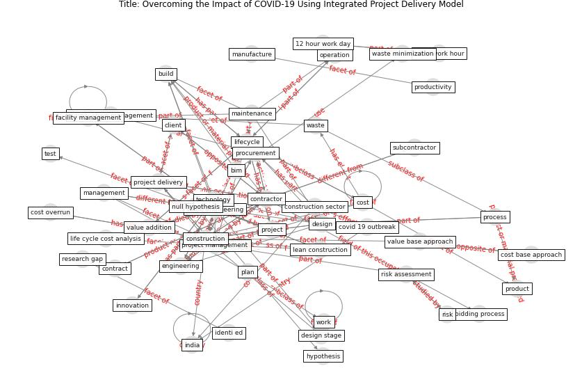

# Article: __Overcoming the Impact of COVID-19 Using Integrated Project Delivery Model__ (g_overcoming_2020)

* [10.21203/rs.3.rs-66806/v1](https://doi.org/10.21203/rs.3.rs-66806/v1)
* Cluster: [construction-project](cluster_9)

## Keywords

[construction](keyword_construction), [contractor](keyword_contractor), [design](keyword_design), [project](keyword_project), [engineering](keyword_engineering), [technology](keyword_technology)

## Abstract

Abstract Value engineering is a systematic approach,
widely used to optimize the design or process or product in
the designing stage. It used to achieve the client's
obligation by increasing the functionality and attain the
targeted cost in the cost planning. Value engineering
effectiveness and benefits decrease along with the progress
of the project since the change in the scope of the work
and design will account for more cost all along the
lifecycle of the project. Integrating the value engineering
with other project management activities will promote cost
minimization, client satisfaction, and ensure early
completion of the project in time. Previous research
studies suggested that value engineering can integrate with
other project delivery activities, but research studies
unable to frame a model that collaborates the project
management activities with the job plan of value
engineering approach. Analysing various project management
activities and their synergy between each other have
studied. The project management activities and processes
like a)risk analysis b)lifecycle cost analysis c)lean
construction d)facility management e)Building information
modelling f)Contract administration, collaborated, and
project delivery model planned along with the Royal
Institute of British Architects (RIBA ) plan of work. The
key outcome of the research is a value-driven project
delivery model, which will succeed in dealing with the
economic impact, constraints and conflicts arise due to the
COVID-19 outbreak in the Indian construction sector.
Benefits associated with the structured framework is
construction project delivery that ensures early contractor
involvement, mutual risk sharing, and reviving the project
with a cost overrun and delay back on track, discussed in
the research

## Concepts

 

