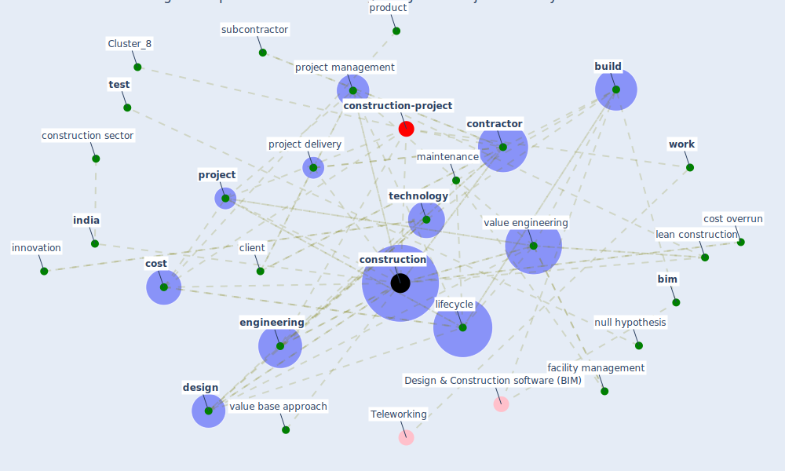

# Article: Overcoming the Impact of COVID-19 Using Integrated Project Delivery Model (g_overcoming_2020)

* Source: [10.21203/rs.3.rs-66806/v1](https://doi.org/10.21203/rs.3.rs-66806/v1)
* Year: 2020
* Cluster: [construction-pandemic](cluster_1)

## Keywords

 * 12 hour work day, [architect](keyword_architect), bene ts, bidding process, [bim](keyword_bim), [build](keyword_build), category, client, co work model, con ict, con ict of interest, [conflict of interest](keyword_conflict_of_interest), [construction](keyword_construction), construction methodology, construction process, construction sector, construction stage, [contract](keyword_contract), [contractor](keyword_contractor), cost, cost base approach, cost overrun, cost planning, covid 19 outbreak, [covid-19](keyword_covid-19), daily, datum analysis, datum collection, delhi, [design](keyword_design), design stage, [engineering](keyword_engineering), execution, [facility management](keyword_facility_management), faculty management, [government](keyword_government), hypothesis, identi ed, [india](keyword_india), [industry](keyword_industry), infrastructure project, [innovation](keyword_innovation), job plan, labor cost, labor shortage, labor work hour, lean construction, life cycle cost analysis, lifecycle, [maintenance](keyword_maintenance), [management](keyword_management), [manufacture](keyword_manufacture), methodology, modular construction, moratuwa, non functional, null hypothesis, operation, [outbreak](keyword_outbreak), [plan](keyword_plan), planner, [process](keyword_process), procurement, product, [productivity](keyword_productivity), programme implementation, [project](keyword_project), project delivery, project delivery model, [project management](keyword_project_management), project scope, reliability, research gap, riba plan of work, [risk](keyword_risk), risk assessment, rupee, satellite oce, sensitivity analysis, [service](keyword_service), sri lanka, statistic, subcontractor, [supply chain management](keyword_supply_chain_management), [technology](keyword_technology), test, tier 3, tier 4, time, university of moratuwa, unskilled worker, value addition, value base, value base approach, [value engineering](keyword_value_engineering), value integrate project delivery, value management, waste, waste minimization, [work](keyword_work)

## Concepts

 

## Neighbours

### Closest articles

* Effects to Construction Project Management Impacted Circular Economic of Covid-19 Pandemic - [LINK](article_paikan_effects_2021)
* COVID-19 pandemic: the effects and prospects in the construction industry. - [LINK](article_ogunnusi_covid-19_2020)
* Perception of COVID-19 impacts on the construction industry over time - [LINK](article_rokooei_perception_2022)
* Propositions for a Resilient, Post-COVID-19 Future for the AEC Industry - [LINK](article_nassereddine_propositions_2021)
* Influence between COVID-19 Impacts and Project Stakeholders in Chilean Construction Projects - [LINK](article_araya_influence_2021)
* The Impact of Pandemic Crisis on the Survival of Construction Industry: A Case of COVID-19 - [LINK](article_gamil_impact_2020)
* Mechanisms for addressing the impact of COVID-19 on infrastructure projects - [LINK](article_king_mechanisms_2021)
* The Effects of Pandemic on Construction Industry in the UK - [LINK](article_shibani_effects_2020)
* Guidelines for Responding to COVID-19 Pandemic: Best Practices, Impacts, and Future Research Directions - [LINK](article_assaad_guidelines_2021)
* Identifying Actions to Control and Mitigate the Effects of the COVID-19 Pandemic on Construction Organizations: Preliminary Findings - [LINK](article_raoufi_identifying_2021)

### Closest BPs

* Blueprint: Monitoring of wastewater - [LINK](bp_21)
* Blueprint: Smart Locker System - [LINK](bp_1)
* Blueprint: Mental health – Belong: Do something with someone - [LINK](bp_19)
