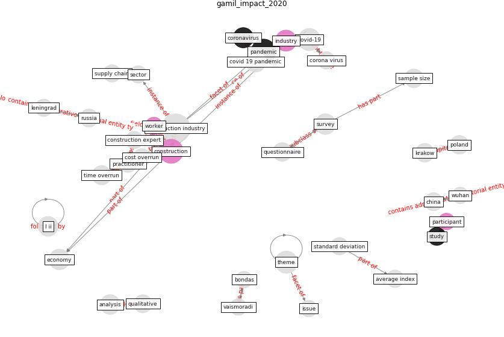

# Article: __The Impact of Pandemic Crisis on the Survival of Construction Industry: A Case of COVID-19__ (gamil_impact_2020)

* [10.36941/mjss-2020-0047](https://doi.org/10.36941/mjss-2020-0047)
* Cluster: [construction-project](cluster_3.md)

## Keywords

[pandemic](keyword_pandemic.md), [construction](keyword_construction.md), [industry](keyword_industry.md), [coronavirus](keyword_coronavirus.md), [analysis](keyword_analysis.md)

## Abstract

Since the World Health Organization (WHO) announced the
coronavirus 2019 (COVID-19) outbreak as a pandemic, many
countries have declared a complete national lockdown after
a remarkable spike in COVID 19 cases. These decisions have
restricted the movement of people and resulted in a
complete shutdown of many businesses across many sectors.
The construction industry, as a significant growth driver
of the economy with no exception, has also been completely
shut down. All the developments and projects were postponed
until further notice. It is, therefore, a prudent to
address the impact of the pandemic at the outset and end of
the crisis to prepare for any future possibility and gain
lessons for plans. This study aims to investigate the
effect of COVID 19 on the construction industry's survival.
The impacts and fallout have been determined and evaluated
through the recruitment of construction experts and
practitioners. The impacts have been classified into
different groups which include economic, human resources.
The study implied two methods include exploratory
interviews and questionnaire surveys. The study found the
most prominent impacts of COVID 19 are the suspension of
projects, labour impact and job loss, time overrun, cost
overrun, and financial implications. The findings of this
study shed light on the consequences of the sudden
occurrence of pandemic and raise awareness of the most
critical impacts which can’t be overlooked. The findings
also help project stakeholders to realise the sequences of
the sudden epidemic and prepare for the worst-case scenario
during the planning stage of the construction projects.

## Concepts

 

