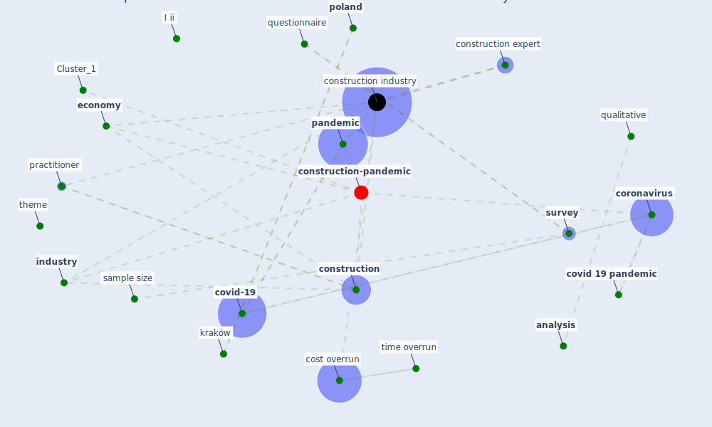

# Article: The Impact of Pandemic Crisis on the Survival of Construction Industry: A Case of COVID-19 (gamil_impact_2020)

* Source: [10.36941/mjss-2020-0047](https://doi.org/10.36941/mjss-2020-0047)
* Year: 2020
* Cluster: [construction-pandemic](cluster_1)

## Keywords

 * 95 confidence level, I ii, alsafi, amanda, [analysis](keyword_analysis), [architect](keyword_architect), average index, bondas, category, [china](keyword_china), collect the datum, [construction](keyword_construction), construction expert, [construction industry](keyword_construction_industry), construction industry sector, construction planning, construction project, consultancy, content analysis, [contractor](keyword_contractor), [coronavirus](keyword_coronavirus), coronavirus disease, [coronavirus outbreak](keyword_coronavirus_outbreak), cost overrun, [covid 19 crisis](keyword_covid_19_crisis), [covid 19 pandemic](keyword_covid_19_pandemic), [covid-19](keyword_covid-19), diploma, [economic](keyword_economic), economic downturn, [economy](keyword_economy), [epidemic](keyword_epidemic), escalate situation, expert, gross domestic product, human resource, [impact](keyword_impact), [industry](keyword_industry), input, interpretation, issue, job lose, kamasah, kerwan, kraków, label, labour impact, leningrad, likert, [lockdown](keyword_lockdown), [logistic](keyword_logistic), [london](keyword_london), margin of error, matec, maximum error of estimation, [medical](keyword_medical), methodology, minimum ss, movement and measure control period, ntoumi, [nursing](keyword_nursing), [opinion](keyword_opinion), organization, palestine, [pandemic](keyword_pandemic), [participant](keyword_participant), petrona, planner, [poland](keyword_poland), practitioner, [project](keyword_project), [qualitative](keyword_qualitative), questionnaire, recession, resource economic, [russia](keyword_russia), [sample](keyword_sample), sample size, scheduler, scheduling, sciences, [sector](keyword_sector), spss, [stakeholder](keyword_stakeholder), standard deviation, [study](keyword_study), [supply chain](keyword_supply_chain), [survey](keyword_survey), survival, tabulate, tariff, the crisis, the pandemic, [theme](keyword_theme), time overrun, transportation, vaismoradi, world after coronavirus, [wuhan](keyword_wuhan), yemen

## Concepts

 

## Neighbours

### Closest articles

* Mechanisms for addressing the impact of COVID-19 on infrastructure projects - [LINK](article_king_mechanisms_2021)
* Perception of COVID-19 impacts on the construction industry over time - [LINK](article_rokooei_perception_2022)
* COVID-19 pandemic: the effects and prospects in the construction industry. - [LINK](article_ogunnusi_covid-19_2020)
* Covid-19 Associated Risks and Mitigation Strategies relevant for the UK Construction Industry - [LINK](article_dan-jumbo_covid-19_2021)
* Identifying Actions to Control and Mitigate the Effects of the COVID-19 Pandemic on Construction Organizations: Preliminary Findings - [LINK](article_raoufi_identifying_2021)
* Influence between COVID-19 Impacts and Project Stakeholders in Chilean Construction Projects - [LINK](article_araya_influence_2021)
* Effects to Construction Project Management Impacted Circular Economic of Covid-19 Pandemic - [LINK](article_paikan_effects_2021)
* The Effects of Pandemic on Construction Industry in the UK - [LINK](article_shibani_effects_2020)
* Strategies to Mitigate COVID-19 Pandemic Impacts on Health and Safety of Workers in Construction Projects - [LINK](article_kaushal_strategies_2021)
* Guidelines for Responding to COVID-19 Pandemic: Best Practices, Impacts, and Future Research Directions - [LINK](article_assaad_guidelines_2021)

### Closest BPs

* Blueprint: Monitoring of wastewater - [LINK](bp_21)
* Blueprint: Smart Locker System - [LINK](bp_1)
* Blueprint: Mental health – Belong: Do something with someone - [LINK](bp_19)
