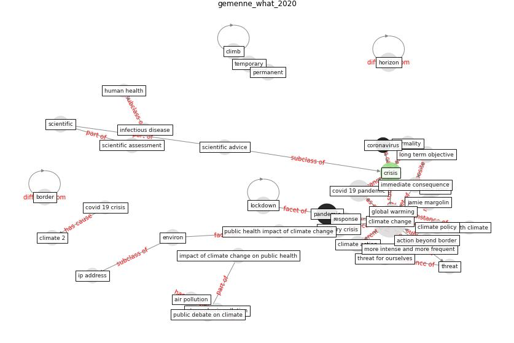

# Article: __What our response to the COVID-19 pandemic tells us of our capacity to respond to climate change__ (gemenne_what_2020)

* [10.1088/1748-9326/abb851](https://doi.org/10.1088/1748-9326/abb851)
* Cluster: [climate-change](cluster_12)

## Keywords

* [climate change](keyword_climate_change), [covid 19 pandemic](keyword_covid_19_pandemic), [crisis](keyword_crisis), [pandemic](keyword_pandemic), [long term objective](keyword_long_term_objective), permanent, [jamie margolin](keyword_jamie_margolin), [scientific](keyword_scientific), temporary, climate action, [sanitary crisis](keyword_sanitary_crisis), immediate consequence, climate 2, normality, impact of climate change on public health

## Keywords at large

* [climate change](keyword_climate_change), [covid 19 pandemic](keyword_covid_19_pandemic), [crisis](keyword_crisis), [pandemic](keyword_pandemic), [horizon](keyword_horizon), [long term objective](keyword_long_term_objective), [lockdown](keyword_lockdown), [scientific](keyword_scientific), [jamie margolin](keyword_jamie_margolin), [sanitary crisis](keyword_sanitary_crisis)

## Concepts

 

### Closest articles 

* [The impact of climate change on the epidemiology and
control of Rift Valley fever - PubMed](article_martin_impact_2008)
* [Coronavirus and Climate Change](article_harvard_th_chan_schoold_of_public_health_coronavirus_2020)
* [harvard_chan_community_coronavirus_2020](article_harvard_chan_community_coronavirus_2020)
* [How Can Blockchain Help People in the Event of Pandemics Such as the COVID-19?](article_chang_how_2020)
* [Supporting Technologies for COVID-19 Prevention: Systemized Review](article_zhao_supporting_2022)
* [COVID-19 and regional solutions for mitigating the risk of SME finance in selected ASEAN member states](article_taghizadeh-hesary_covid-19_2022)
* [Health Information Exchange with Blockchain amid Covid-19-like Pandemics](article_christodoulou_health_2020)
* [World Bank Development Report](article_world_bank_world_2022)
* [Physical interventions to interrupt or reduce the spread of respiratory viruses: systematic review](article_jefferson_physical_2008)
* [COVID-19 Prevention and Control Measures in Workplace Settings: A Rapid Review and Meta-Analysis](article_ingram_covid-19_2021)

