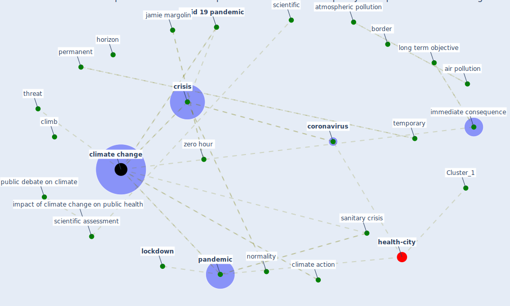

# Article: What our response to the COVID-19 pandemic tells us of our capacity to respond to climate change (gemenne_what_2020)

* Source: [10.1088/1748-9326/abb851](https://doi.org/10.1088/1748-9326/abb851)
* Year: 2020
* Cluster: [construction-pandemic](cluster_1)

## Keywords

 * 101002 f gemenne, action, action beyond border, [air pollution](keyword_air_pollution), [analysis](keyword_analysis), atmospheric pollution, availability statement, border, citizen, clim, [climate](keyword_climate), climate 2, climate action, [climate change](keyword_climate_change), climate change as a crisis, climate emergency, climate model, climate policy, climb, [confinement](keyword_confinement), cooperation, [coronavirus](keyword_coronavirus), coronavirus crisis, [covid 19 crisis](keyword_covid_19_crisis), [covid 19 pandemic](keyword_covid_19_pandemic), [covid-19](keyword_covid-19), [crisis](keyword_crisis), cultural, data availability statement, [datum](keyword_datum), datum availability, declare a state of climate emergency, depoux, develop country, different solution, [distance](keyword_distance), earth, earth climate, economic development, [economy](keyword_economy), geneva, gravitationalwave, gw150914, [horizon](keyword_horizon), [human health](keyword_human_health), immediate and near consequence of climate change, immediate consequence, immediate consequence of climate change, impact of climate change on public health, [infectious disease](keyword_infectious_disease), international, irreversible, irreversible transformation, jamie margolin, lancet countdown initiative, [lockdown](keyword_lockdown), long run, long term objective, [measure](keyword_measure), measure that need to be take, measure that need to be take to address climate change, more intense, more intense and more frequent, most vulnerable, national, [nature](keyword_nature), normality, [outbreak](keyword_outbreak), [pandemic](keyword_pandemic), pandemic can be replicate as such, paris, [permanent](keyword_permanent), protect, protect the most vulnerable, public debate on climate, [public health](keyword_public_health), public health impact, public health impact of climate change, public health issue, response, response measure, response measure to be deploy, sanitary crisis, scientific, scientific advice, scientific assessment, [solution](keyword_solution), temporary, the environment, the pandemic, the us, threat, threat for ourselves, transformation, universite de paris, vulnerable, wearetheproblem, who climate change and health, [world health organization](keyword_world_health_organization), zero hour

## Concepts

 

## Neighbours

### Closest articles

* Coronavirus and Climate Change - [LINK](article_harvard_th_chan_schoold_of_public_health_coronavirus_2020)
* COVID-19 risks and systemic gaps in Nigeria: resilience building lessons for pandemic and climate change management - [LINK](article_lawal_covid-19_2022)
* Navigating Climate Change: Rethinking the Role of Buildings - [LINK](article_cole_navigating_2020)
*  - [LINK](article_yakubu_aminu_dodo_green_2020)
* Responsible Transport: A post-COVID agenda for transport policy and practice - [LINK](article_budd_responsible_2020)
* Mobility Behaviour in View of the Impact of the COVID-19 Pandemic—Public Transport Users in Gdansk Case Study - [LINK](article_przybylowski_mobility_2021)
* Revisiting the built environment: 10 potential development changes and paradigm shifts due to COVID-19 - [LINK](article_cheshmehzangi_revisiting_2021)
* The Smart City and Covid‐19 - [LINK](article_webb_smart_2020)
* The three modes of existence of the pandemic smart city - [LINK](article_soderstrom_three_2021)

### Closest BPs

* Blueprint: Smart Locker System - [LINK](bp_1)
* Blueprint: Mental health – Belong: Do something with someone - [LINK](bp_19)
* Blueprint: Mental health – Act: Do something - [LINK](bp_18)
