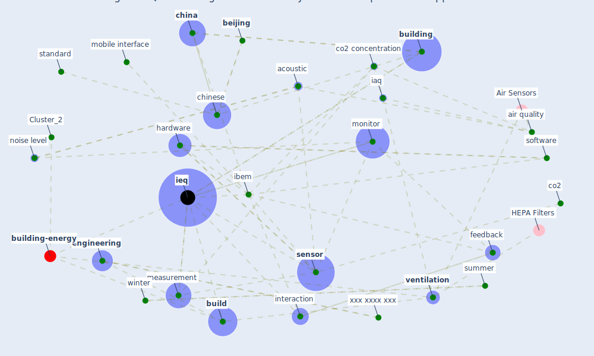

# Article: An Intelligent IEQ Monitoring and Feedback System: Development and Applications (geng_intelligent_2021)

* Source: [10.1016/j.eng.2021.09.017](https://doi.org/10.1016/j.eng.2021.09.017)
* Year: 2021
* Cluster: [building-energy](cluster_2)

## Keywords

 * academic research, acoustic, acoustic performance, [air pollutant](keyword_air_pollutant), air quality, air temperature, ansi, [application](keyword_application), arduino, [ashrae](keyword_ashrae), [beijing](keyword_beijing), [build](keyword_build), [building](keyword_building), building type a, building type b, [china](keyword_china), china architecture, [chinese](keyword_chinese), climate zone, cloud server, co location, co2, co2 concentration, data transmission module, database, datum transmission, [engineering](keyword_engineering), [environment](keyword_environment), feedback, floor, floor area, [germany](keyword_germany), hardware, [hospital](keyword_hospital), [iaq](keyword_iaq), [ibem](keyword_ibem), [ieq](keyword_ieq), indoor air, [indoor air quality](keyword_indoor_air_quality), indoor air temperature, [indoor environment](keyword_indoor_environment), industrial, inpatient, intelligent ieq, [interaction](keyword_interaction), iq, kim h, manton r, measurement, measurement accuracy, mobile interface, [monitor](keyword_monitor), noise level, objective, [occupant](keyword_occupant), occupant satisfaction, p p p p p, parameter, parkinson, particulate matter, performance test, philadelphia, pm2, private office, purification, r2, reference sensor, relative humidity, [samba](keyword_samba), [sensor](keyword_sensor), slope, software, [standard](keyword_standard), subjective, subscriber identity module, summer, [survey](keyword_survey), [symptom](keyword_symptom), [temperature](keyword_temperature), top floor, university of pennsylvania, [ventilation](keyword_ventilation), [ward](keyword_ward), wargocki, wargocki p, web platform, weight, [wi fi](keyword_wi_fi), wi fi transmission, [winter](keyword_winter), wireless, [wuhan](keyword_wuhan), wyon dp, xxx xxx xxx y, xxx xxxx xxx, xxx xxxx xxx fig, xxx xxxx xxx y, yu, zhang, zuhaib s

## Concepts

 

## Neighbours

### Closest articles

* Continuous IEQ monitoring system: Context and development - [LINK](article_parkinson_continuous_2019)
* Scalable IoT Architecture for Monitoring IEQ Conditions in Public and Private Buildings - [LINK](article_calvo_scalable_2022)
* A comprehensive review on indoor air quality monitoring systems for enhanced public health - [LINK](article_saini_comprehensive_2020)
* Occupants’ behavior and activity patterns influencing the energy consumption in the Kuwaiti residences - [LINK](article_al-mumin_occupants_2003)
* Impacts of COVID-19 on residential building energy use and performance - [LINK](article_kawka_impacts_2021)
* The effect of occupant distribution on energy consumption and COVID-19 infection in buildings: A case study of university building - [LINK](article_mokhtari_effect_2021)
* Compliance with COVID-19 Mitigation Measures in the United States - [LINK](article_van_rooij_compliance_2020)
* The Intelligent Lockdown: Compliance with COVID-19 Mitigation Measures in the Netherlands - [LINK](article_kuiper_intelligent_2020)
* Assessment of Building Automation and Control Systems in Danish Healthcare Facilities in the COVID-19 Era - [LINK](article_pedersen_assessment_2022)
* Mitigation strategies and compliance in the COVID-19 fight; how much compliance is enough? - [LINK](article_mukerjee_mitigation_2021)

### Closest BPs

* Blueprint: Indoor Environmental Quality (IEQ) monitoring system - [LINK](bp_3)
* Blueprint: nan - [LINK](bp_34)
* Blueprint: Tender support at building stage - [LINK](bp_9)
