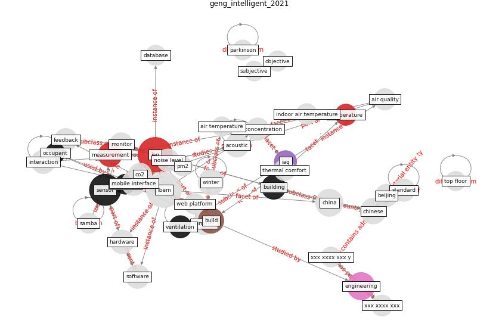

# Article: __An Intelligent IEQ Monitoring and Feedback System: Development and Applications__ (geng_intelligent_2021)

* [10.1016/j.eng.2021.09.017](https://doi.org/10.1016/j.eng.2021.09.017)
* Cluster: [building-health](cluster_10)

## Keywords

* [ibem](keyword_ibem), [ieq](keyword_ieq), [sensor](keyword_sensor), [engineering](keyword_engineering), [china](keyword_china), [winter](keyword_winter), [chinese](keyword_chinese), [build](keyword_build), [mobile interface](keyword_mobile_interface), [building](keyword_building), [hardware](keyword_hardware), measurement, [software](keyword_software), [interaction](keyword_interaction), [acoustic](keyword_acoustic)

## Keywords at large

* [biophilic design](keyword_biophilic_design), [architecture](keyword_architecture), [sustainable architecture](keyword_sustainable_architecture), [nature](keyword_nature), [design](keyword_design), [biophilic](keyword_biophilic), [environ](keyword_environ), [biophilia](keyword_biophilia), [wellbeing](keyword_wellbeing), [health](keyword_health)

## Concepts

 

### References 

* [Continuous IEQ monitoring system: Context and
development](article_parkinson_continuous_2019)

### Cited by 

