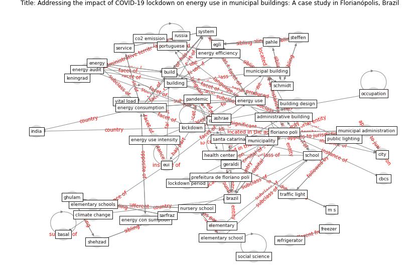

# Article: __Addressing the impact of COVID-19 lockdown on energy use in municipal buildings: A case study in Florianópolis, Brazil__ (geraldi_addressing_2021)

* [10.1016/j.scs.2021.102823](https://doi.org/10.1016/j.scs.2021.102823)
* Cluster: [building-space](cluster_7)

## Keywords

[building](keyword_building), [build](keyword_build), [energy](keyword_energy), [system](keyword_system)

## Concepts

 

### References 

* [Occupants’ behavior and activity patterns influencing
the energy consumption in the Kuwaiti residences](article_al-mumin_occupants_2003)
* [A critical analysis of the impacts of COVID-19 on the
global economy and ecosystems and opportunities for
circular economy strategies](article_ibn-mohammed_critical_2021)
* [Antivirus-built environment: Lessons learned from
Covid-19 pandemic](article_megahed_antivirus-built_2020)

### Cited by 

* [Prophylactic Architecture: Formulating the Concept
of Pandemic-Resilient Homes](article_elrayies_prophylactic_2022)
