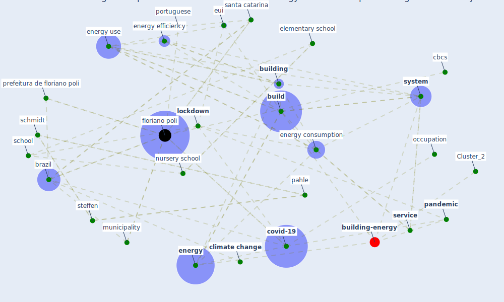

# Article: Addressing the impact of COVID-19 lockdown on energy use in municipal buildings: A case study in Florianópolis, Brazil (geraldi_addressing_2021)

* Source: [10.1016/j.scs.2021.102823](https://doi.org/10.1016/j.scs.2021.102823)
* Year: 2021
* Cluster: [building-energy](cluster_2)

## Keywords

 * abc, administrative building, [ashrae](keyword_ashrae), azevedo, babatunde, basal, [brazil](keyword_brazil), [build](keyword_build), build energy use, [building](keyword_building), building design, building feature, building performance, cbcs, chamandoust, [china](keyword_china), [city](keyword_city), clean energy transition, [climate change](keyword_climate_change), co2 emission, [computer](keyword_computer), conselho brasileiro de construça o sustenta vel, [covid 19 crisis](keyword_covid_19_crisis), covid 19 lockdown, [covid-19](keyword_covid-19), d oca, derakhshan, e mail address, egli, elementary, [elementary school](keyword_elementary_school), elementary schools, [energy](keyword_energy), energy audit, energy con sumption, energy consumer, [energy consumption](keyword_energy_consumption), [energy efficiency](keyword_energy_efficiency), energy use, energy use in building, energy use intensity, environmental, equipment, eui, [floriano poli](keyword_floriano_poli), freezer, geraldi, ghulam, health center, heating, [hvac](keyword_hvac), ibn mohamme, [india](keyword_india), [italy](keyword_italy), leningrad, lighting, [lockdown](keyword_lockdown), lockdown period, long term horizon, m s, [manhattan](keyword_manhattan), mid term, motivation, municipality, [new york city](keyword_new_york_city), nursery, [nursery school](keyword_nursery_school), occupation, omidvarborna, operation, organ, pahle, [pandemic](keyword_pandemic), plug load, portuguese, prefeitura de floriano poli, public lighting, rebound effect, refrigerator, [russia](keyword_russia), santa catarina, sarfraz, saúde pública doença covid 19, schmidt, [school](keyword_school), [service](keyword_service), shah, shehzad, [social](keyword_social), [spain](keyword_spain), st petersburg, steffen, stock analysis, sustainable city and society, [system](keyword_system), tm22, traffic light, typologie, work from home policy, yoshino

## Concepts

 

## Neighbours

### Closest articles

* Reflecting on Impacts of COVID19 on Sustainable Buildings and Cities - [LINK](article_gonzalez_reflecting_2021)
* Impacts of COVID-19 on residential building energy use and performance - [LINK](article_kawka_impacts_2021)
* The effect of occupant distribution on energy consumption and COVID-19 infection in buildings: A case study of university building - [LINK](article_mokhtari_effect_2021)
* Assessment of Building Automation and Control Systems in Danish Healthcare Facilities in the COVID-19 Era - [LINK](article_pedersen_assessment_2022)
* Occupants’ behavior and activity patterns influencing the energy consumption in the Kuwaiti residences - [LINK](article_al-mumin_occupants_2003)
* Contextualizing the Covid-19 pandemic for a carbon-constrained world: Insights for sustainability transitions, energy justice, and research methodology - [LINK](article_sovacool_contextualizing_2020)
* Validity of energy social research during and after COVID-19: challenges, considerations, and responses - [LINK](article_fell_validity_2020)
* Covid-19 and the politics of sustainable energy transitions - [LINK](article_kuzemko_covid-19_2020)
* Ten questions concerning occupant health in buildings during normal operations and extreme events including the COVID-19 pandemic - [LINK](article_awada_ten_2021)
* Occupant health in buildings: Impact of the COVID-19 pandemic on the opinions of building professionals and implications on research - [LINK](article_awada_occupant_2022)

### Closest BPs

* Blueprint: nan - [LINK](bp_34)
* Blueprint: Tender support at building stage - [LINK](bp_9)
* Blueprint: Building Adaptation during a pandemic - [LINK](bp_14)
